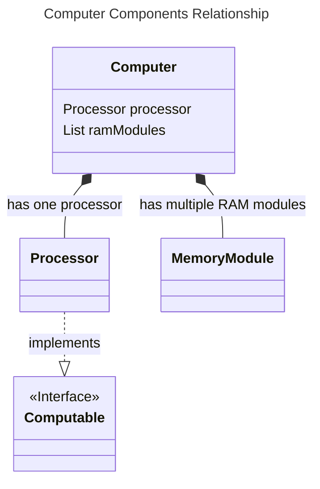
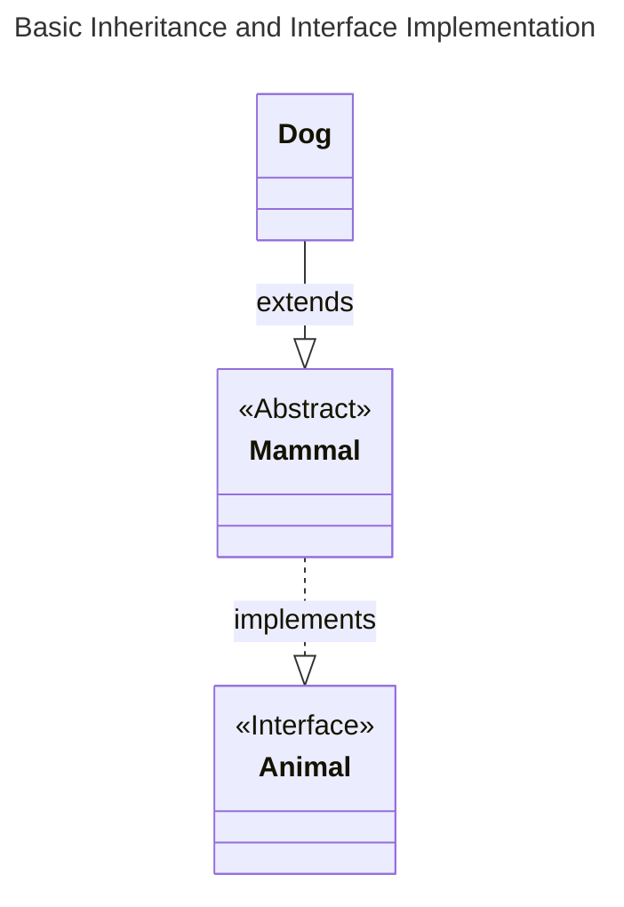
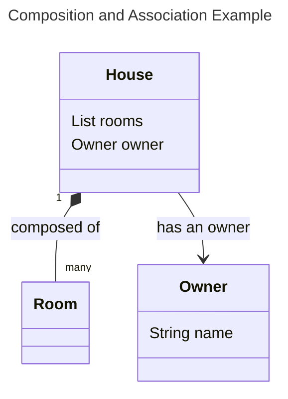
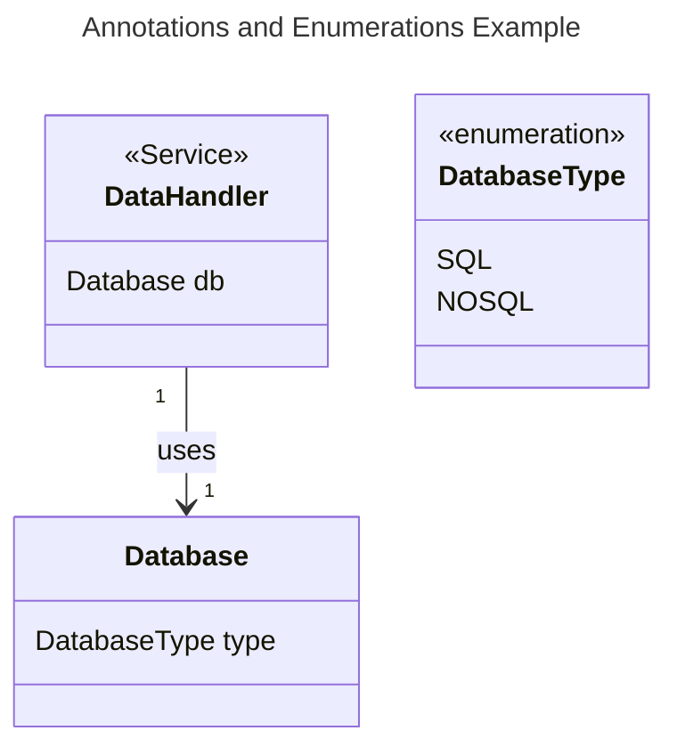
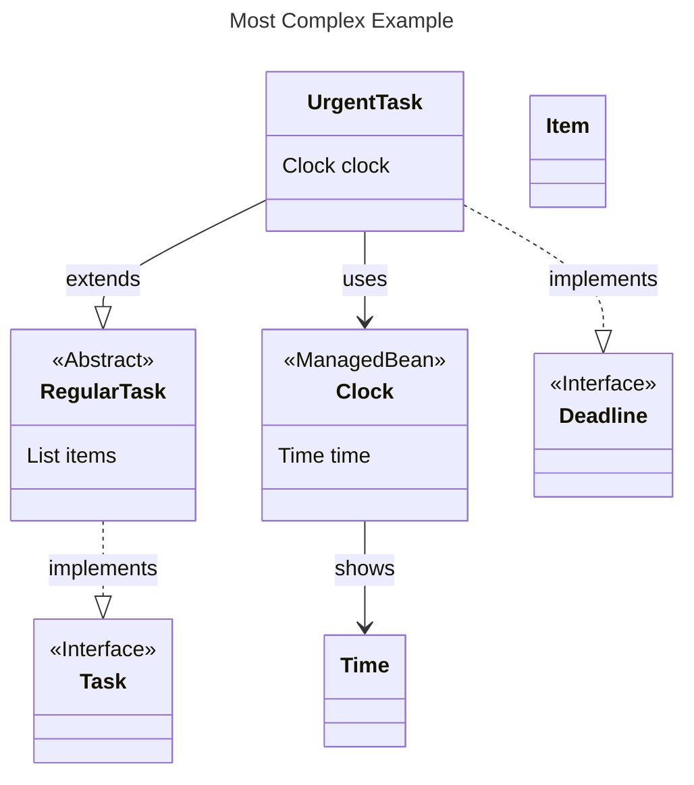
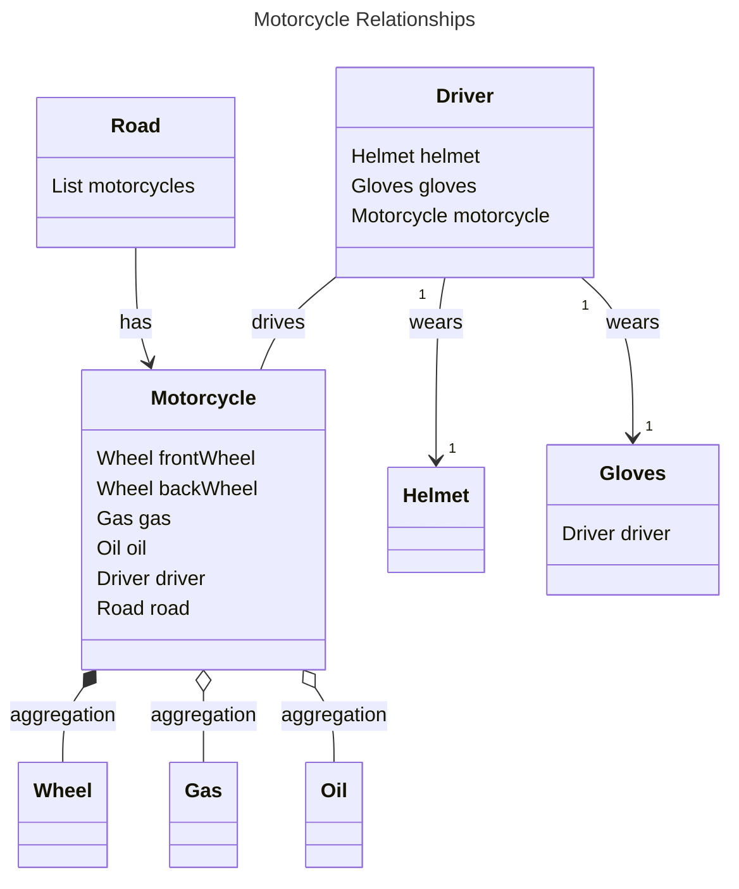
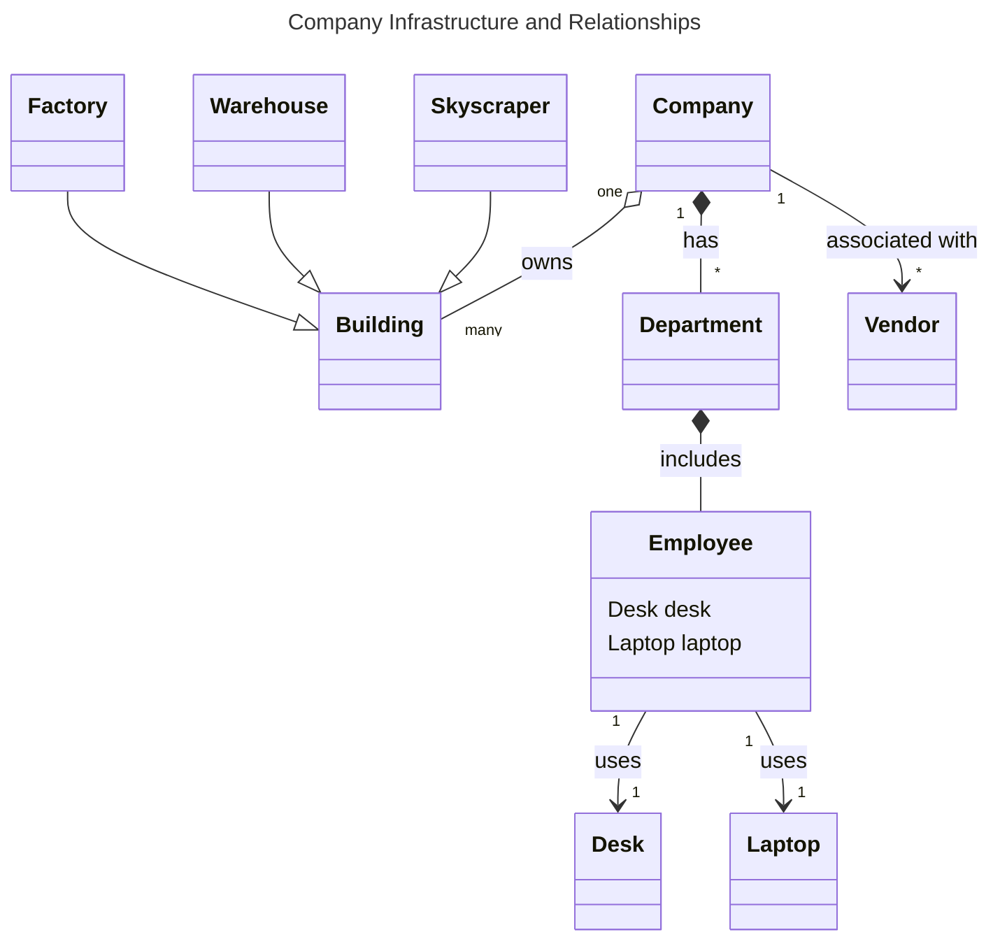

# Part 1: Generating examples 

## Java Input 1:

```java
public interface Computable { }

public class Computer {
    private Processor processor;
    private List<MemoryModule> ramModules;
}

public class Processor { }

public class MemoryModule { }

```

## Mermaid Output 1:



## Java Input 2:

```java
public interface Animal { }

public abstract class Mammal implements Animal { }

public class Dog extends Mammal {
}

```

## Mermaid Output 2:



## Java Input 3:

```java
public class House {
    private List<Room> rooms;
    private Owner owner;
}

public class Room {
}

public class Owner {
    private String name;
}

```

## Mermaid Output 3:



## Java Input 4:

```java

@Service
public class DataHandler {
    private Database db;
}

public enum DatabaseType {
    SQL,
    NOSQL
}

public class Database {
    private DatabaseType type;
}

```

## Mermaid Output 4:



## Java Input 5:

```java
@Component
public interface Task { }

public abstract class RegularTask implements Task {
    private List<Item> items;
}

public class UrgentTask extends RegularTask implements Deadline {
    private Clock clock;
}

@ManagedBean
public class Clock {
    private Time time;
}

public class Time {
}

public class Item {
}

public interface Deadline {
}

```

## Mermaid Output 5:


# Motorcycle Example 
## Motorcycle Relationships

**1. Motorcycle Aggregates:**
- `Motorcycle` is an aggregate of `Wheels`, `Helmet`, `Gas`, and `Oil`. This means that a `Motorcycle` consists of these parts, but they can exist independently. For example, you can have a wheel without a motorcycle.

**2. Motorcycle and Driver Association:**
- A `Motorcycle` is driven by a `Driver`. This is an association since the relationship is bidirectional.

**3. Driver's Attire:**
- A `Driver` might wear `Gloves` and a `Helmet` while driving a motorcycle.

**4. Motorcycle and Road Association:**
- A `Motorcycle` runs on a `Road`. This is an association.


## Input Java 
```java

public class Motorcycle {
    private Wheel frontWheel;
    private Wheel backWheel;
    private Helmet helmet;
    private Gas gas;
    private Oil oil;
    private Driver driver;
    private Road road;

    // Constructors, getters, setters, and methods would be here.
}

public class Wheel {
    // Attributes and methods related to the wheel.
}

public class Helmet {
    // Attributes and methods related to the helmet.
}

public class Gloves {
    private Driver driver;

    // Attributes and methods related to gloves.
}

public class Gas {
    // Attributes and methods related to gas.
}

public class Oil {
    // Attributes and methods related to oil.
}

public class Driver {
    private Helmet helmet;
    private Gloves gloves;
    private Motorcycle motorcycle;

    // Constructors, getters, setters, and methods would be here.
}

public class Road {
    private List<Motorcycle> motorcycles;

    // Attributes and methods related to the road.
}

```


## Output Mermaid Class Diagram 


---

# Company Building Example 

## Company Infrastructure and Relationships

- **Building Types**:
    - `Skyscrapers`, `Warehouses`, and `Factories` are all types of `Buildings`.  (inheritance). 
    - While a company owns buildings, buildings can exist even without being associated with a company.

- **Ownership**:
    - A `Company` owns multiple types of `Buildings` such as `Skyscrapers`, `Warehouses`, and `Factories`.

- **Company and Departments**:
    - A `Company` consists of multiple `Departments`. This relationship is a composition since departments are intrinsic to the company.

- **Department and Employees**:
    - Each `Department` includes multiple `Employees`. This is also a composition relationship.

- **Employee's Resources**:
    - An `Employee` might use a `Desk` and a `Laptop`. This is an association since they can exist independently of the employee.

- **Vendors**:
    - A `Company` might have associations with multiple `Vendors` to provide services or goods.


## Input Mermaid Class Diagram




## Output Java 

```java 

public abstract class Building {
    private Company owner;
    // ... other attributes and methods
}

public class Skyscraper extends Building {
    // ... attributes and methods specific to Skyscraper
}

public class Warehouse extends Building {
    // ... attributes and methods specific to Warehouse
}

public class Factory extends Building {
    // ... attributes and methods specific to Factory
}

public class Company {
    private List<Building> buildings;
    private List<Department> departments;
    private List<Vendor> vendors;
    // ... other attributes and methods
}

public class Department {
    private List<Employee> employees;
    // ... other attributes and methods
}

public class Employee {
    private Desk desk;
    private Laptop laptop;
    // ... other attributes and methods
}

public class Vendor {
    // ... attributes and methods related to vendor
}

public class Desk {
    // ... attributes and methods related to the desk
}

public class Laptop {
    // ... attributes and methods related to the laptop
}

```
