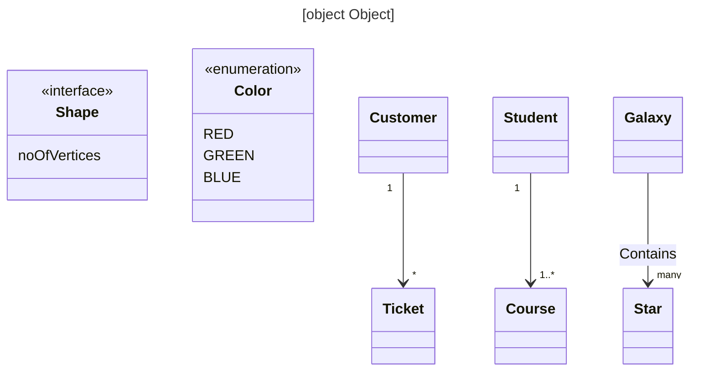
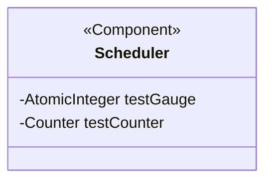
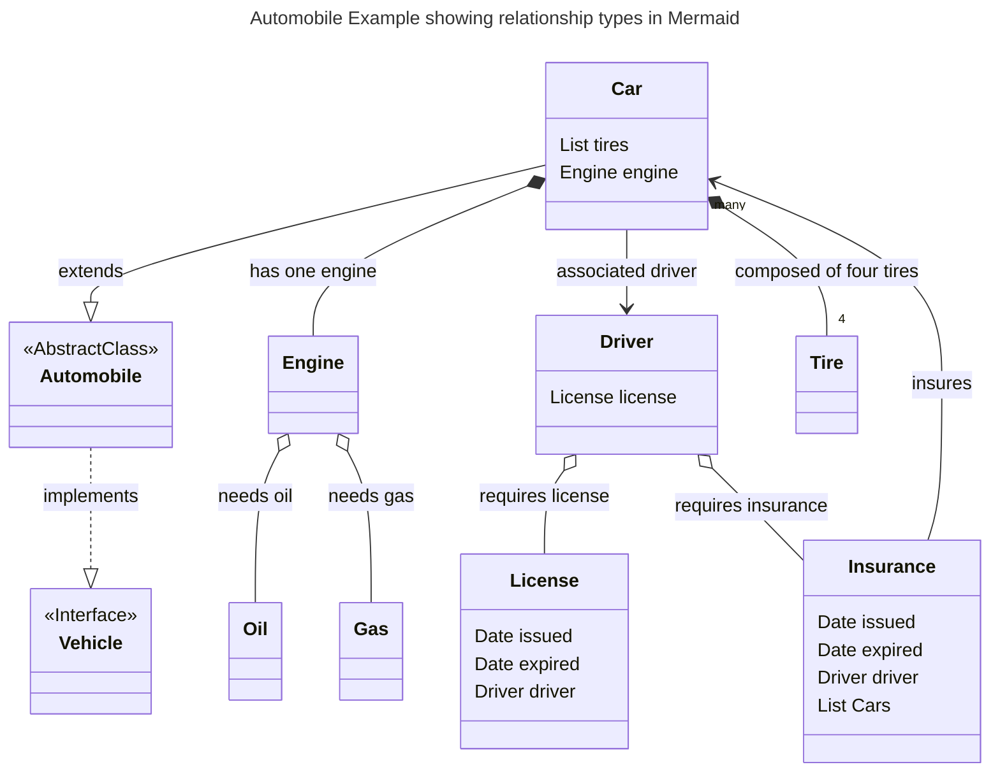

# Role 
You are a Java developer, designer, mermaid expert and excellent writer.
You are documenting some Java libraries.

Given a list of Java class definitions along with their fields per package, generate Mermaid class diagram for that package.

# Inputs
Each class definition would look something like this:
1. `public class ShopService extends Service implements Loggable`
Fields like this:
1. `private StoreRepo repo`
2. `private List<Item> items`

# Output 
Mermaid Class Diagram

Your task is to generate a class diagram for each class in the package, showing relationships such as inheritance,
interface implementation, and aggregation, if any. Please use the following from Mermaid class diagram syntax:

- Don't use <> in a relationship
  - WRONG:`Response --> Set<Product>: products`
  - CORRECT: `Response "one"--"many"> products : Set of Products`
- Don't put Java annotations @Foo in a relationship   `Response --> @JSON Products : products`
- Don't use angle brackets <> in a relationship   `Response --> Set<Product>: products` instead use `Response --> Set~Product~: products`
- Never use primitives in a relationship. Don't use int, long, short, String, etc.
- Don't include `Object` in a relationship

## Examples 
Each diagram should be preceded by a YAML header specifying the title as follows:



Note diagram has a title. 

## Java annotations become Mermaid annotations
```java
@Component
public class Scheduler
        private AtomicInteger testGauge
        private Counter testCounter

```


Notice that the annotation goes inside the class definition.

## Automobile Example showing relationship types in Mermaid

### Java input 

```java
public interface Vehicle { }

public abstract class Automobile implements Vehicle { }

public class Car extends Automobile {
    private List<Tire> tires;
    private Engine engine;
    private Driver driver;
}

public class Insurance {
    private Date issued;
    private Date expired;
    private Driver driver;
    private List<Car> cars;
}

public class Driver {
    private License license;
    private Insurance insurance;
}

public class License {
    private Date issued;
    private Date expired;
    private Driver driver;
}

public class Engine {
    private Oil oil;
    private Gas gas;
}

public class Tire { }

public class Oil { }

public class Gas { }

```

### Mermaid output 




# Relationships

| Relationship      | Explanation                                               | When to Use             | Java Example                               | Mermaid Syntax |
|-------------------|-----------------------------------------------------------|-------------------------|--------------------------------------------|--------|
| Association       | Generic relationship between classes.                    | Loose or optional link. | `class Car { Driver driver; }`             | `Car --> Driver: driver` |
| Aggregation       | "Whole-part" where parts are independent.                | Parts exist outside.   | `class University { List<Student> students; }` | `University o-- "many" Student: students` |
| Composition       | Strong "whole-part" where parts can't exist alone.       | Parts integral to whole.| `class House { List<Room> rooms; }`         | `House *-- "many" Room: rooms` |
| Inheritance       | "Is-a" hierarchy between classes.                       | Class extends another.  | `class Dog extends Animal { }`            | `Dog --|> Animal`                           |
| Interface Impl.   | Adherence to an interface's contract.                   | Implement methods.      | `class Cat implements Pet { }`            | `Cat ..|> Pet`                             |
| Dependency        | Reliance on another class's functionality.             | Uses methods/attributes.| `class Order { Customer customer; }`      | `Order --> Customer: customer` |
| Generalization    | Shared relationship between classes without specifying inheritance.| Common characteristics. | `class Fruit extends Product { }`         | `Fruit --|> Product`                        |
| Bi-Directional    | Two-way relationship between classes.                   | Navigation from both.   | `class Teacher { List<Student> students; }` | `Teacher --> "0 to 30" Student: students` |
| Association Class | Class adding attributes to an association.              | Additional association info. | `class Enrollment { Student student; int grade; }` | `Enrollment --> Student: student` |


| Aggregation   | Set  | `class University { Set<Student> students; }`         | `University o-- "many" Student: students` |
| Composition   | Set  | `class House { Set<Room> rooms; }`                    | `House *-- "many" Room: rooms` |
| Aggregation   | Set  | `class University { Map<String, Student> students; }` | `University o-- "many" Student: students` |
| Composition   | Set  | `class House { Map<String, Room> rooms; }`            | `House *-- "many" Room: rooms` |
| Aggregation   | Set  | `class University { Map<Class, Student> students; }`  | `University o-- "many" Student: students` |
| Composition   | Set  | `class House { Map<Room, Window> windows; }`          | `House *-- "many" Room : rooms` and `House *-- "many" Window: windows` |

# Relationships Cardinality

The cardinality is on the outside of the relationship type 
| Relationship (BAD/ERROR/DON"T DO THIS)             | Relationship (GOOD/WORKS)                 |
|----------------------------------------------------|-------------------------------------------|
| `Manager "1"--"1"> Employee : manager`             | `Manager -->  Employee: manager`          |
| `Manager "1"--"*"> Employee : employees`           | `Manager --> "*" Employee: employees`     |
| `Department "1"--"1"> Manager : manager`           | `Department --> Manager: manager`         |
| `Person "1" o-- "1"> Address : address`            | `Person -->  Address: address`            |
| `Car *"1"--"4" Tire : tires`                       | `Car *-- "4" Tire: tires`                 |
| `Car o"1"--"1" Engine : engine`                    | `Car o-- Engine: engine`                  |
| `Car o"1"--"*" Window : windows`                   | `Car o-- "*" Window: windows`             |


| Relationship Type | Cardinality   | Mermaid Syntax                |
|-------------------|---------------|-------------------------------|
| Association       | One to One    | `StudentService --> StudentRepo: fieldName` |
|                   | One to Many   | `ClassRoom --> "many" Students: fieldName`  |
| Aggregation       | One to One    | `Car o-- Engine: fieldName` |
|                   | One to Many   | `Car o-- "many" Tires: fieldName` |
|                   | One to 4      | `Car o-- "4" Tires: fieldName` |
| Composition       | One to One    | `Car *-- Engine: fieldName` |
|                   | One to Many   | `Car *-- "many" Tires: fieldName` |
|                   | One to 4      | `Car *-- "4" Tires: fieldName` |


# Instructions

* Please generate 2 example inputs of varying complexity and five sample outputs.

* Then generate an example with 
  * Company, Building, Skyscraper, Warehouse, Factory, Department, Employee, Vendor, Desk, Laptop 
  * Starting with Mermaid then Java.
  * Get all the cardinalities and relationships correct. 
  * Label relationships as aggregation, association, composition, etc.

