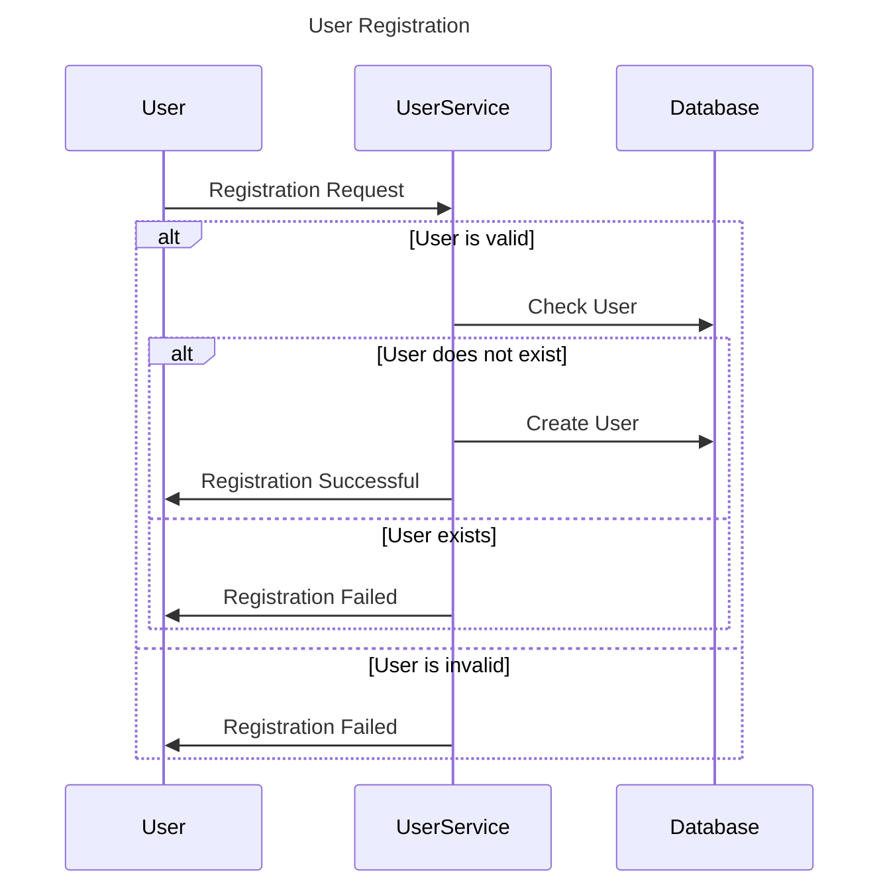
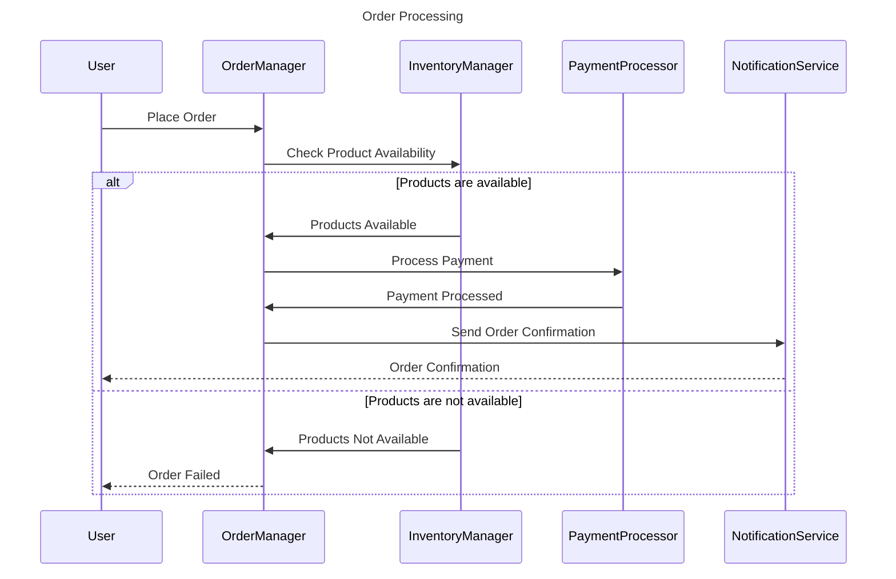
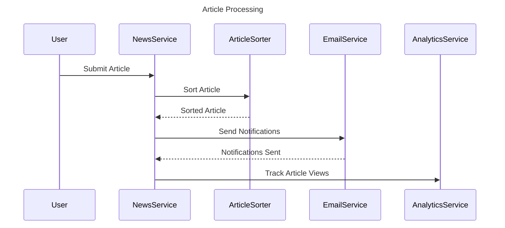
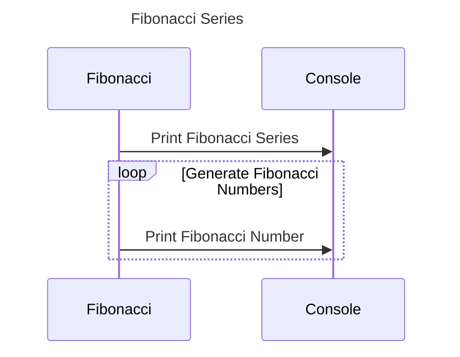
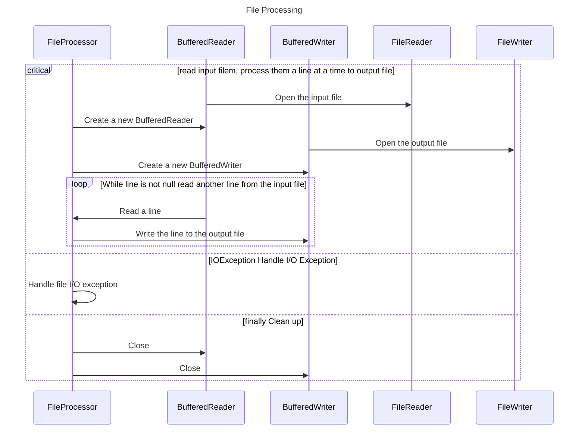
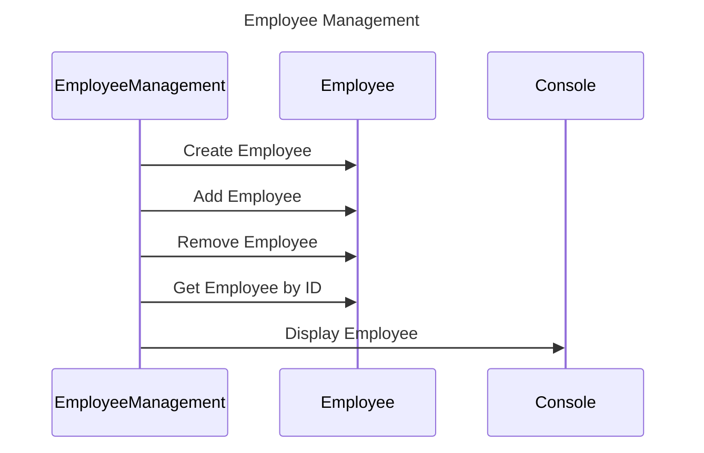
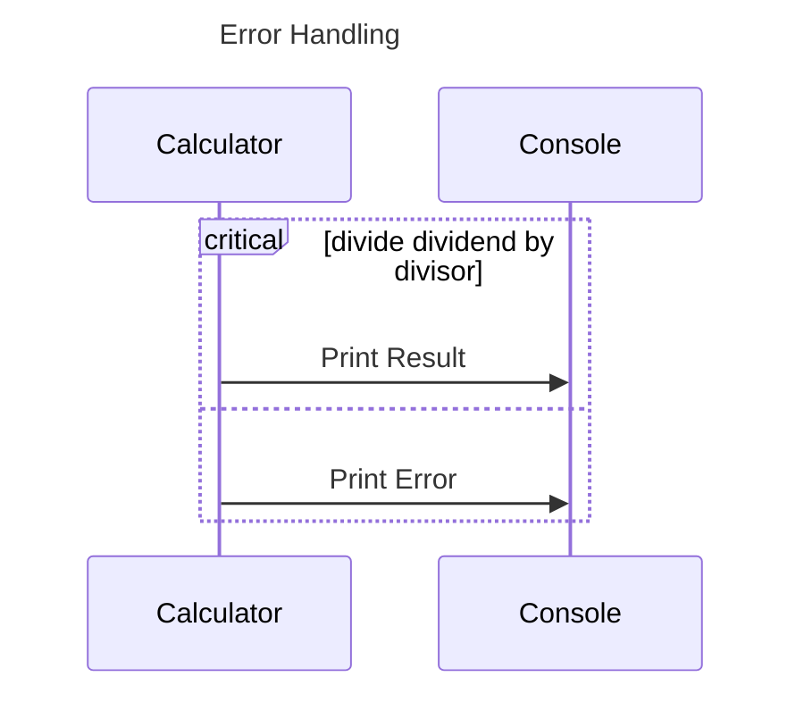
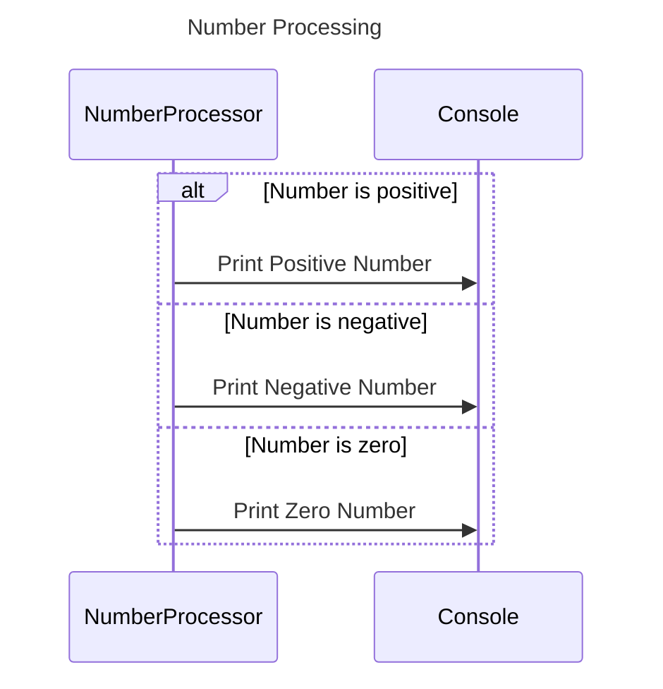
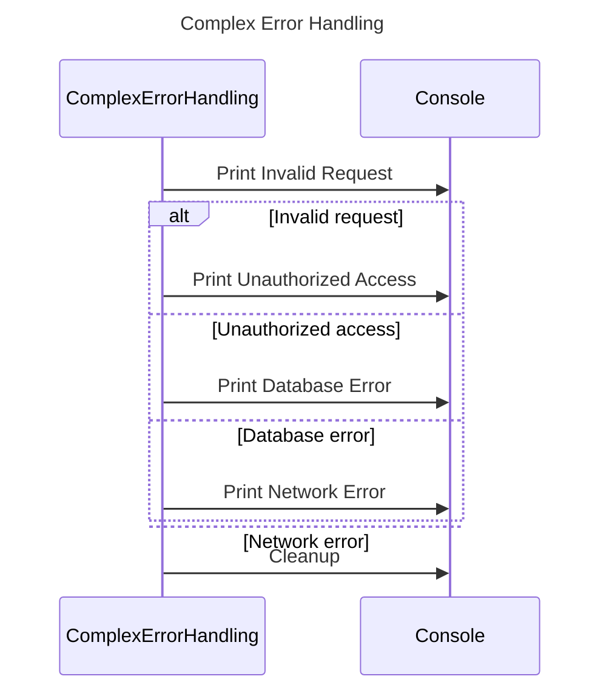
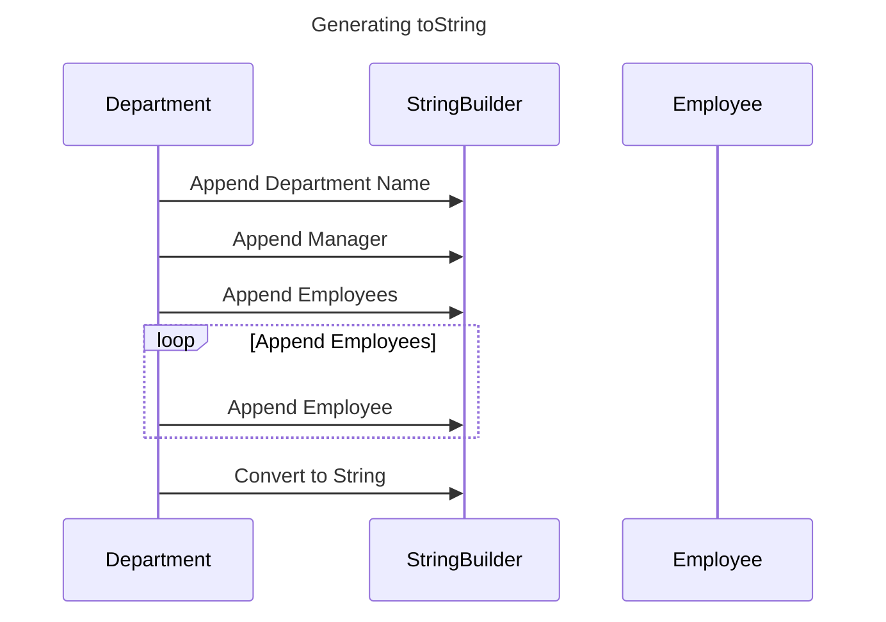

# Desirable Participants

1. NewsService
2. ArticleSorter
3. PaymentProcessor
4. EmailService
5. UserService
6. OrderManager
7. InventoryManager
8. NotificationService
9. AnalyticsService
10. RecommendationEngine

# Undesirable Participants

1. String
2. Integer
3. Float
4. Boolean
5. byte[]
6. Throwable
7. Exception
8. System.out
9. File
10. ObjectNode

# Sequence Diagram 1: User Registration

## Description
This sequence diagram illustrates the process of user registration in a system. The `UserService` is responsible for handling user registration requests and interacting with the `Database` to store user information.

## Participants
- User: Represents a user who wants to register.
- UserService: Handles user registration requests.
- Database: Stores user information.

## Interactions
1. User sends a registration request to the UserService.
2. UserService validates the user's information.
3. UserService checks if the user already exists in the Database.
4. If the user already exists, UserService sends a response indicating that the registration failed.
5. If the user does not exist, UserService creates a new user record in the Database.
6. UserService sends a response indicating that the registration was successful.

## Mermaid Sequence Diagram


## Java Code Example
```java
public class UserService {
    private Database database;

    public void registerUser(User user) {
        if (isValidUser(user)) {
            if (!database.userExists(user)) {
                database.createUser(user);
                user.registrationSuccessful();
            } else {
                user.registrationFailed();
            }
        } else {
            user.registrationFailed();
        }
    }

    private boolean isValidUser(User user) {
        // Validation logic
    }
}

public class Database {
    public boolean userExists(User user) {
        // Check if user exists in the database
    }

    public void createUser(User user) {
        // Create a new user record in the database
    }
}

public class User {
    public void registrationSuccessful() {
        // Handle successful registration
    }

    public void registrationFailed() {
        // Handle failed registration
    }
}
```

# Sequence Diagram 2: Order Processing

## Description
This sequence diagram depicts the process of order processing in an e-commerce system. The `OrderManager` receives order requests, validates them, and interacts with the `InventoryManager` to check product availability. If the products are available, the `PaymentProcessor` is invoked to process the payment. Finally, the `NotificationService` is used to send order confirmation to the user.

## Participants
- User: Represents a user who places an order.
- OrderManager: Handles order processing.
- InventoryManager: Manages product inventory.
- PaymentProcessor: Processes payments for orders.
- NotificationService: Sends order confirmation to the user.

## Interactions
1. User places an order.
2. OrderManager validates the order.
3. OrderManager checks the availability of products with the InventoryManager.
4. If products are available, OrderManager invokes the PaymentProcessor to process the payment.
5. PaymentProcessor processes the payment.
6. OrderManager sends an order confirmation to the user via the NotificationService.

## Mermaid Sequence Diagram


## Java Code Example
```java
public class OrderManager {
    private InventoryManager inventoryManager;
    private PaymentProcessor paymentProcessor;
    private NotificationService notificationService;

    public void processOrder(User user, Order order) {
        if (isValidOrder(order)) {
            if (inventoryManager.checkProductAvailability(order)) {
                paymentProcessor.processPayment(order);
                notificationService.sendOrderConfirmation(user, order);
            } else {
                user.orderFailed();
            }
        } else {
            user.orderFailed();
        }
    }

    private boolean isValidOrder(Order order) {
        // Validation logic
    }
}

public class InventoryManager {
    public boolean checkProductAvailability(Order order) {
        // Check product availability in the inventory
    }
}

public class PaymentProcessor {
    public void processPayment(Order order) {
        // Process payment for the order
    }
}

public class NotificationService {
    public void sendOrderConfirmation(User user, Order order) {
        // Send order confirmation to the user
    }
}

public class User {
    public void orderFailed() {
        // Handle failed order
    }
}
```

# Sequence Diagram 3: Article Processing

## Description
This sequence diagram showcases the process of article processing in a news system. The `NewsService` receives article requests, sorts them using the `ArticleSorter`, and interacts with the `EmailService` to send notifications to subscribers. Additionally, the `AnalyticsService` is used to track article views.

## Participants
- User: Represents a user who submits an article.
- NewsService: Handles article processing.
- ArticleSorter: Sorts articles based on relevance.
- EmailService: Sends notifications to subscribers.
- AnalyticsService: Tracks article views.

## Interactions
1. User submits an article to the NewsService.
2. NewsService processes the article.
3. NewsService sorts the article using the ArticleSorter.
4. NewsService sends notifications to subscribers via the EmailService.
5. AnalyticsService tracks the views of the article.

## Mermaid Sequence Diagram


## Java Code Example
```java
public class NewsService {
    private ArticleSorter articleSorter;
    private EmailService emailService;
    private AnalyticsService analyticsService;

    public void processArticle(User user, Article article) {
        articleSorter.sortArticle(article);
        emailService.sendNotifications(article);
        analyticsService.trackArticleViews(article);
    }
}

public class ArticleSorter {
    public void sortArticle(Article article) {
        // Sort the article based on relevance
    }
}

public class EmailService {
    public void sendNotifications(Article article) {
        // Send notifications to subscribers
    }
}

public class AnalyticsService {
    public void trackArticleViews(Article article) {
        // Track article views
    }
}
```

# Java Method 1: Fibonacci Series

## Description
This Java method calculates the Fibonacci series up to a given number. It uses a loop to iterate through the series and generate the Fibonacci numbers.

## Java Code
```java
public class Fibonacci {
    public void generateFibonacciSeries(int limit) {
        int first = 0;
        int second = 1;
        int next;

        System.out.print("Fibonacci Series: " + first + ", " + second);

        for (int i = 2; i < limit; i++) {
            next = first + second;
            System.out.print(", " + next);
            first = second;
            second = next;
        }
    }
}
```

## Mermaid Sequence Diagram


# Java Method 2: File Processing

## Description
This Java method reads a file, processes its contents, and writes the processed data to another file. 
It uses a try-catch-finally block to handle file I/O operations and ensure proper resource cleanup.

## Java Code
```java
import java.io.BufferedReader;
import java.io.BufferedWriter;
import java.io.FileReader;
import java.io.FileWriter;
import java.io.IOException;

public class FileProcessor {
    public void processFile(String inputFilePath, String outputFilePath) {
        BufferedReader reader = null;
        BufferedWriter writer = null;

        try {
            reader = new BufferedReader(new FileReader(inputFilePath));
            writer = new BufferedWriter(new FileWriter(outputFilePath));

            String line;
            while ((line = reader.readLine()) != null) {
                // Process the line
                String processedLine = processLine(line);
                writer.write(processedLine);
                writer.newLine();
            }
        } catch (IOException e) {
            // Handle file I/O exception
            e.printStackTrace();
        } finally {
            try {
                if (reader != null) {
                    reader.close();
                }
                if (writer != null) {
                    writer.close();
                }
            } catch (IOException e) {
                // Handle file close exception
                e.printStackTrace();
            }
        }
    }

    private String processLine(String line) {
        // Process the line and return the processed data
    }
}
```

## Mermaid Sequence Diagram


# Java Method 3: Employee Management

## Description
This Java method manages a list of employees and provides functionality to add, remove, and retrieve employee information. It uses a switch-case statement to handle different operations based on user input.

## Java Code
```java
import java.util.ArrayList;
import java.util.List;

public class EmployeeManagement {
    private List<Employee> employees;

    public EmployeeManagement() {
        employees = new ArrayList<>();
    }

    public void addEmployee(Employee employee) {
        employees.add(employee);
    }

    public void removeEmployee(Employee employee) {
        employees.remove(employee);
    }

    public Employee getEmployeeById(int id) {
        for (Employee employee : employees) {
            if (employee.getId() == id) {
                return employee;
            }
        }
        return null;
    }

    public void performOperation(int operation) {
        switch (operation) {
            case 1:
                // Add employee
                Employee employee = createEmployee();
                addEmployee(employee);
                break;
            case 2:
                // Remove employee
                Employee employeeToRemove = selectEmployee();
                removeEmployee(employeeToRemove);
                break;
            case 3:
                // Get employee by ID
                int id = enterEmployeeId();
                Employee employeeById = getEmployeeById(id);
                displayEmployee(employeeById);
                break;
            default:
                System.out.println("Invalid operation");
                break;
        }
    }

    private Employee createEmployee() {
        // Create a new employee object
    }

    private Employee selectEmployee() {
        // Select an employee from the list
    }

    private int enterEmployeeId() {
        // Enter the ID of the employee
    }

    private void displayEmployee(Employee employee) {
        // Display employee information
    }
}

public class Employee {
    private int id;
    private String name;
    private String designation;

    // Getters and setters
}
```

## Mermaid Sequence Diagram


# Error Handling Example

## Description
This Java method demonstrates error handling using the `try-catch` block. It attempts to divide two numbers and handles the `ArithmeticException` if the divisor is zero.

## Java Code
```java
public class Calculator {
    public void divideNumbers(int dividend, int divisor) {
        try {
            int result = dividend / divisor;
            System.out.println("Result: " + result);
        } catch (ArithmeticException e) {
            System.out.println("Error: Division by zero");
        }
    }
}
```

## Mermaid Sequence Diagram


# alt/else/end Example

## Description
This Java method demonstrates the use of `alt`, `else`, and `end` blocks to handle different scenarios based on user input. It checks if a number is positive, negative, or zero and performs different operations accordingly.

## Java Code
```java
public class NumberProcessor {
    public void processNumber(int number) {
        if (number > 0) {
            System.out.println("Number is positive");
        } else if (number < 0) {
            System.out.println("Number is negative");
        } else {
            System.out.println("Number is zero");
        }
    }
}
```

## Mermaid Sequence Diagram


# Complex Error Handling Example

## Description
This Java method demonstrates complex error handling using both `alt`/`else`/`end` and `critical`/`option`/`end` blocks. It handles different exceptions and performs specific actions based on the exception type.

## Java Code
```java
public class ComplexErrorHandling {
    public void processRequest(Request request) {
        try {
            validateRequest(request);
            process(request);
        } catch (InvalidRequestException e) {
            System.out.println("Invalid request: " + e.getMessage());
        } catch (UnauthorizedAccessException e) {
            System.out.println("Unauthorized access: " + e.getMessage());
        } catch (DatabaseException e) {
            System.out.println("Database error: " + e.getMessage());
        } catch (NetworkException e) {
            System.out.println("Network error: " + e.getMessage());
        } finally {
            cleanup();
        }
    }

}

```

## Mermaid Sequence Diagram


# Generating toString using StringBuilder

## Description
This Java method generates a `toString` representation of a `Department` object using a `StringBuilder`. 
It loops over the employees in the department and appends their information to the `StringBuilder`.

## Java Code
```java
import java.util.List;

public class Department {
    private String name;
    private Employee manager;
    private List<Employee> employees;

    // Getters and setters

    @Override
    public String toString() {
        StringBuilder sb = new StringBuilder();
        sb.append("Department: ").append(name).append("\n");
        sb.append("Manager: ").append(manager).append("\n");
        sb.append("Employees: ").append("\n");
        for (Employee employee : employees) {
            sb.append(employee).append("\n");
        }
        return sb.toString();
    }
}

public class Employee {
    private int id;
    private String name;
    private String designation;

    // Getters and setters

    @Override
    public String toString() {
        return "Employee [id=" + id + ", name=" + name + ", designation=" + designation + "]";
    }
}
```

## Mermaid Sequence Diagram

