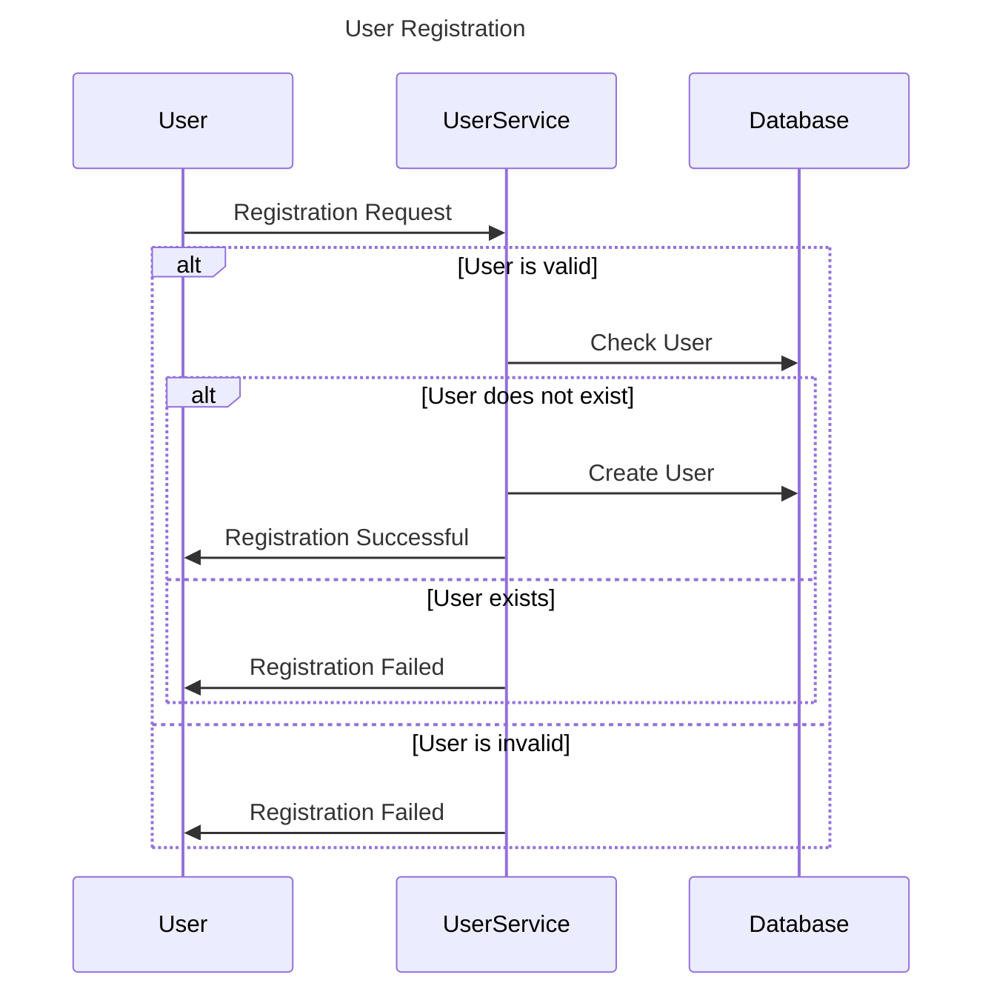
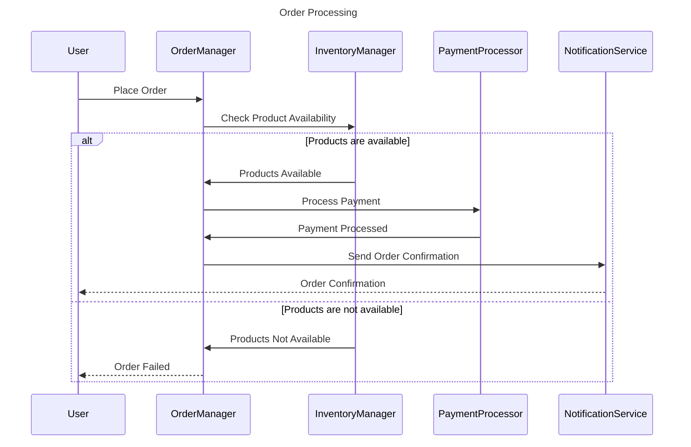
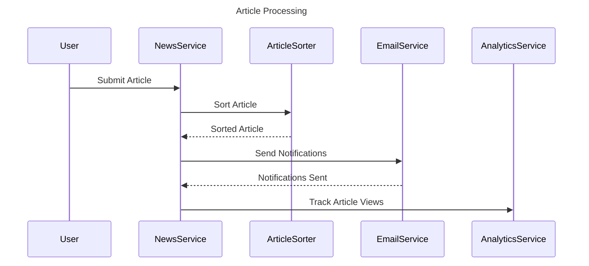
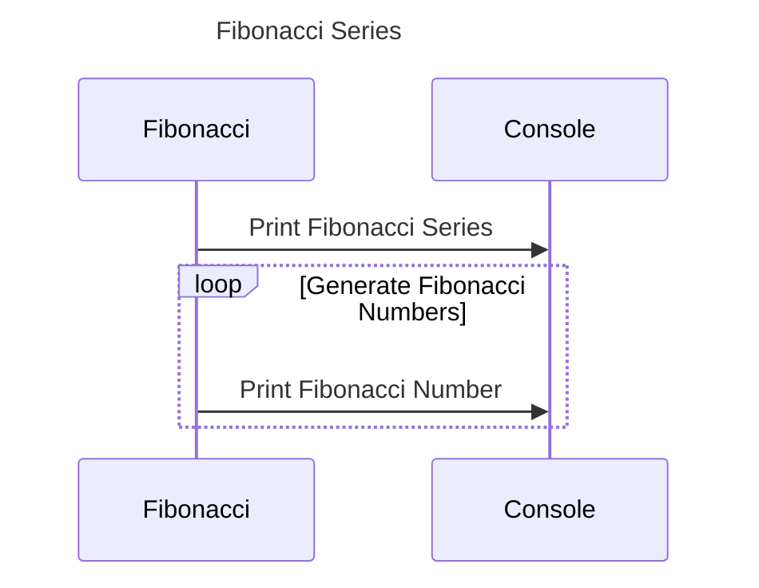
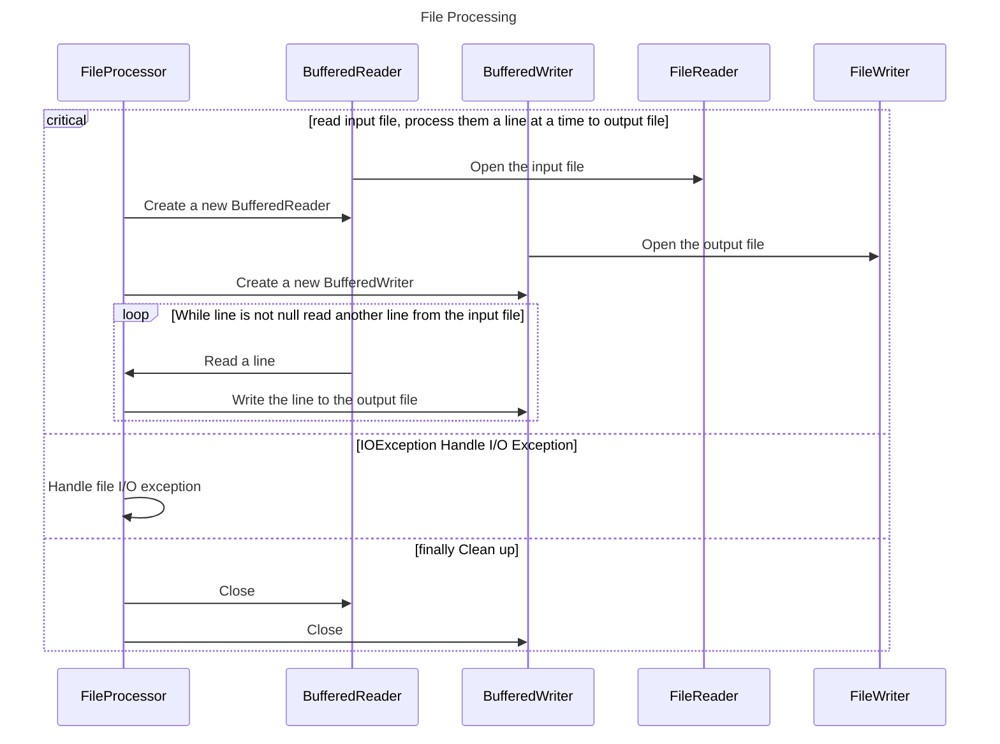
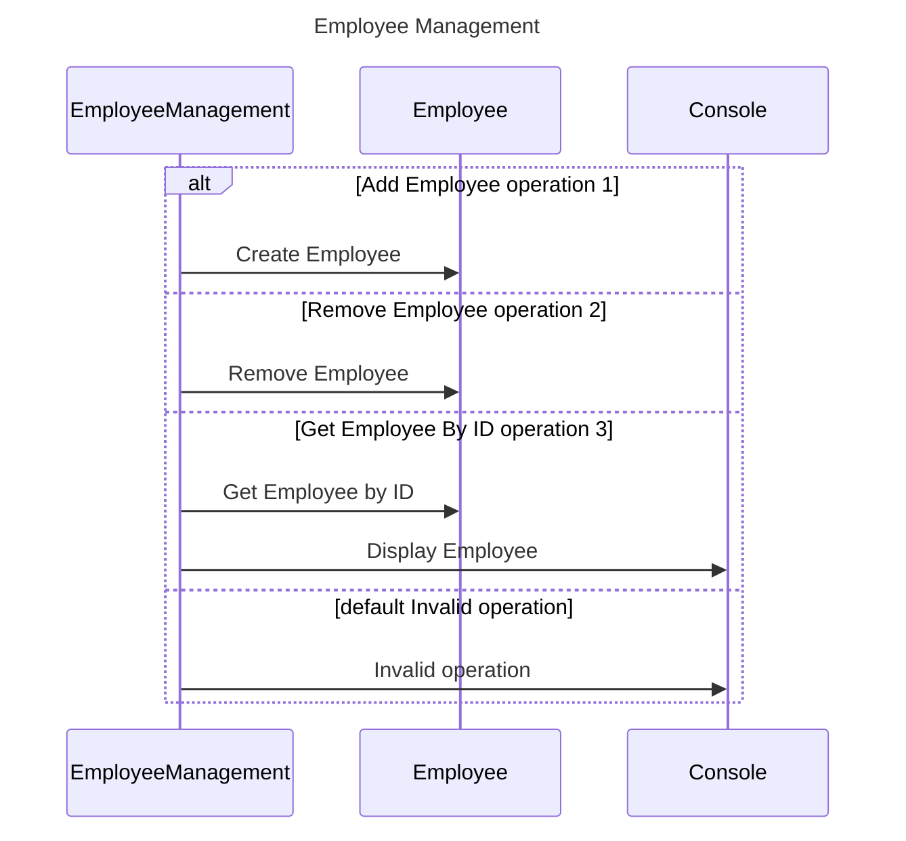
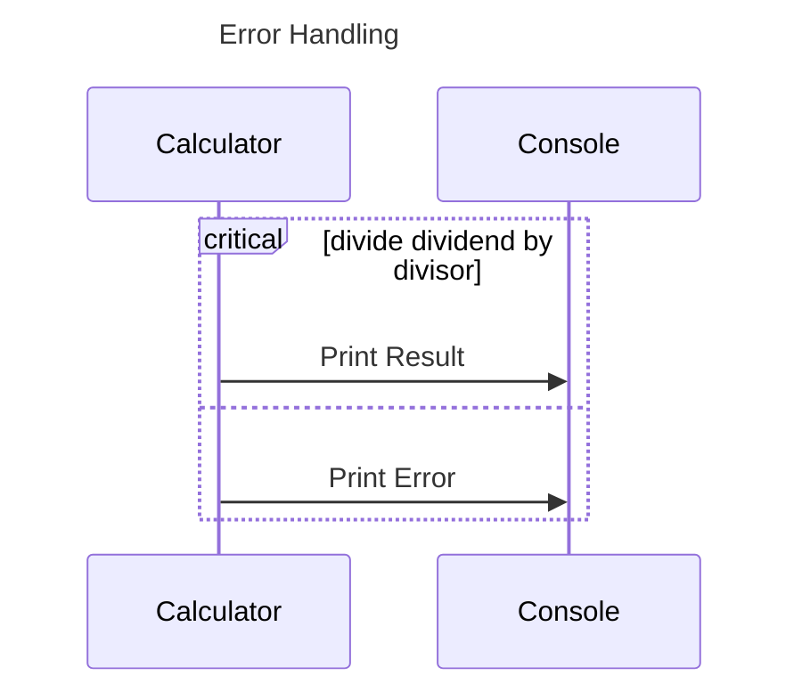
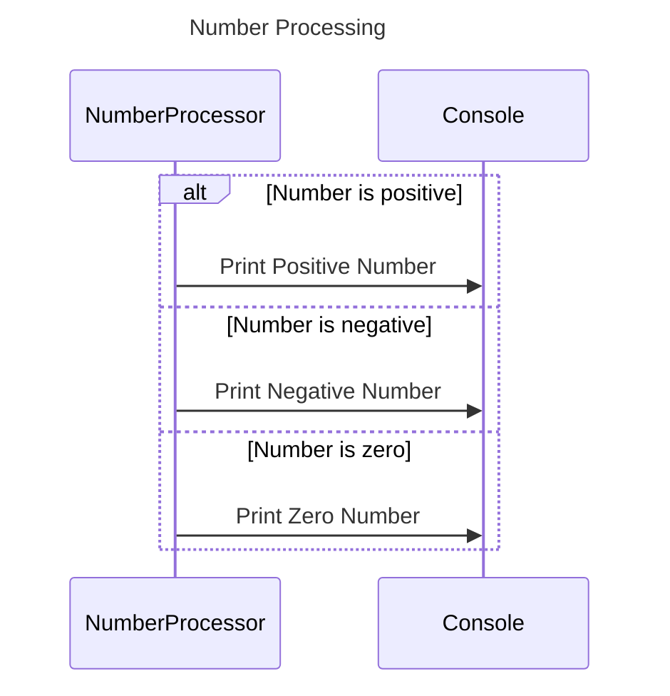
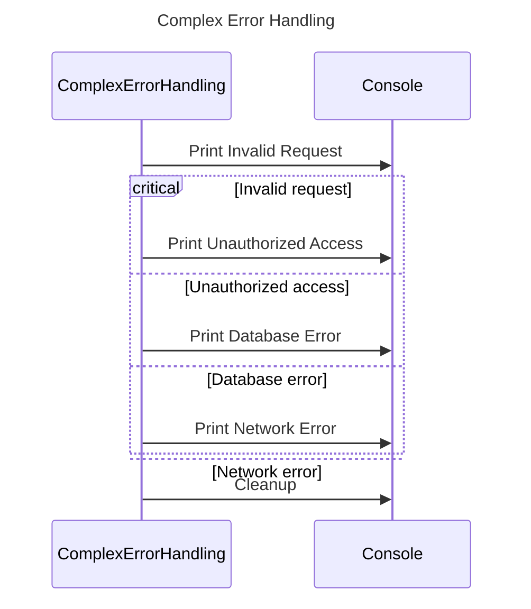
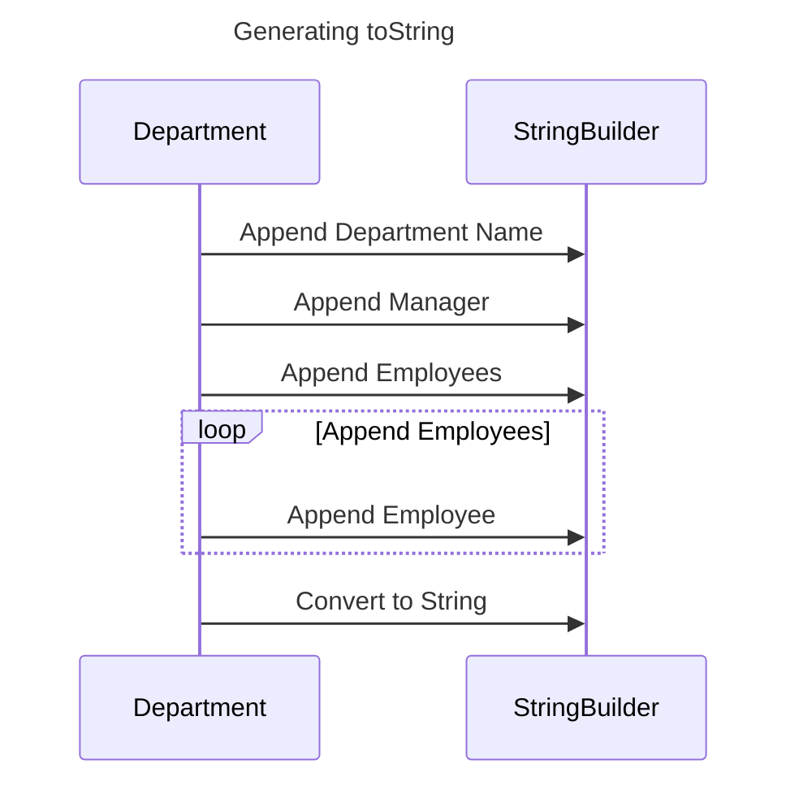

# Desirable Participants

1. NewsService
2. ArticleSorter
3. PaymentProcessor
4. EmailService
5. UserService
6. OrderManager
7. InventoryManager
8. NotificationService
9. AnalyticsService
10. RecommendationEngine

# Undesirable Participants

1. String
2. Integer
3. Float
4. Boolean
5. byte[]
6. Throwable
7. Exception
8. System.out
9. File
10. ObjectNode

# Sequence Diagram 1: User Registration

## Mermaid Sequence Diagram


## Java Code Example
```java
public class UserService {
    //...

    public void registerUser(User user) {
        if (isValidUser(user)) {
            if (!database.userExists(user)) {
                database.createUser(user);
                user.registrationSuccessful();
            } else {
                user.registrationFailed();
            }
        } else {
            user.registrationFailed();
        }
    }
    //...
}
```

# Sequence Diagram 2: Order Processing

## Mermaid Sequence Diagram


## Java Code Example
```java
public class OrderManager {
    private InventoryManager inventoryManager;
    private PaymentProcessor paymentProcessor;
    private NotificationService notificationService;

    public void processOrder(User user, Order order) {
        if (isValidOrder(order)) {
            if (inventoryManager.checkProductAvailability(order)) {
                paymentProcessor.processPayment(order);
                notificationService.sendOrderConfirmation(user, order);
            } else {
                user.orderFailed();
            }
        } else {
            user.orderFailed();
        }
    }
    //...
}

```

# Sequence Diagram 3: Article Processing

## Mermaid Sequence Diagram


## Java Code Example
```java
public class NewsService {
    private ArticleSorter articleSorter;
    private EmailService emailService;
    private AnalyticsService analyticsService;

    public void processArticle(User user, Article article) {
        articleSorter.sortArticle(article);
        emailService.sendNotifications(article);
        analyticsService.trackArticleViews(article);
    }
}
```

# Java Method 1: Fibonacci Series

## Java Code
```java
public class Fibonacci {
    public void generateFibonacciSeries(int limit) {
        int first = 0;
        int second = 1;
        int next;

        System.out.print("Fibonacci Series: " + first + ", " + second);

        for (int i = 2; i < limit; i++) {
            next = first + second;
            System.out.print(", " + next);
            first = second;
            second = next;
        }
    }
}
```

## Mermaid Sequence Diagram


# Java Method 2: File Processing

## Java Code
```java
import java.io.BufferedReader;
import java.io.BufferedWriter;
import java.io.FileReader;
import java.io.FileWriter;
import java.io.IOException;

public class FileProcessor {
    public void processFile(String inputFilePath, String outputFilePath) {
        BufferedReader reader = null;
        BufferedWriter writer = null;

        try {
            reader = new BufferedReader(new FileReader(inputFilePath));
            writer = new BufferedWriter(new FileWriter(outputFilePath));

            String line;
            while ((line = reader.readLine()) != null) {
                // Process the line
                String processedLine = processLine(line);
                writer.write(processedLine);
                writer.newLine();
            }
        } catch (IOException e) {
            // Handle file I/O exception
            e.printStackTrace();
        } finally {
            try {
                if (reader != null) {
                    reader.close();
                }
                if (writer != null) {
                    writer.close();
                }
            } catch (IOException e) {
                // Handle file close exception
                e.printStackTrace();
            }
        }
    }
//...
}
```

## Mermaid Sequence Diagram


# Java Method 3: Employee Management

## Java Code
```java
import java.util.ArrayList;
import java.util.List;

public class EmployeeManagement {
    private List<Employee> employees;
   //..
    public void performOperation(int operation) {
        switch (operation) {
            case 1:
                // Add employee
                Employee employee = createEmployee();
                addEmployee(employee);
                break;
            case 2:
                // Remove employee
                Employee employeeToRemove = selectEmployee();
                removeEmployee(employeeToRemove);
                break;
            case 3:
                // Get employee by ID
                int id = enterEmployeeId();
                Employee employeeById = getEmployeeById(id);
                displayEmployee(employeeById);
                break;
            default:
                System.out.println("Invalid operation");
                break;
        }
    }
    //..
}
```

## Mermaid Sequence Diagram


# Error Handling Example

## Java Code
```java
public class Calculator {
    public void divideNumbers(int dividend, int divisor) {
        try {
            int result = dividend / divisor;
            System.out.println("Result: " + result);
        } catch (ArithmeticException e) {
            System.out.println("Error: Division by zero");
        }
    }
}
```

## Mermaid Sequence Diagram


# alt/else/end Example

## Java Code
```java
public class NumberProcessor {
    public void processNumber(int number) {
        if (number > 0) {
            System.out.println("Number is positive");
        } else if (number < 0) {
            System.out.println("Number is negative");
        } else {
            System.out.println("Number is zero");
        }
    }
}
```

## Mermaid Sequence Diagram


# Complex Error Handling Example

## Java Code
```java
public class ComplexErrorHandling {
    public void processRequest(Request request) {
        try {
            validateRequest(request);
            process(request);
        } catch (InvalidRequestException e) {
            System.out.println("Invalid request: " + e.getMessage());
        } catch (UnauthorizedAccessException e) {
            System.out.println("Unauthorized access: " + e.getMessage());
        } catch (DatabaseException e) {
            System.out.println("Database error: " + e.getMessage());
        } catch (NetworkException e) {
            System.out.println("Network error: " + e.getMessage());
        } finally {
            cleanup();
        }
    }
}

```

## Mermaid Sequence Diagram


# Generating toString using StringBuilder

## Java Code
```java
import java.util.List;

public class Department {
    private String name;
    private Employee manager;
    private List<Employee> employees;

    // Getters and setters

    @Override
    public String toString() {
        StringBuilder sb = new StringBuilder();
        sb.append("Department: ").append(name).append("\n");
        sb.append("Manager: ").append(manager).append("\n");
        sb.append("Employees: ").append("\n");
        for (Employee employee : employees) {
            sb.append(employee).append("\n");
        }
        return sb.toString();
    }
}
//...
}
```

## Mermaid Sequence Diagram

