## Desirable Participants:
1. NewsService
2. ArticleSorter
3. AudioTranscriber
4. ChatBot
5. PaymentProcessor
6. OrderManager
7. EmailSender
8. NotificationService
9. DatabaseManager
10. EmployeeRepo

## Undesirable Participants:
1. File
2. ChatRequest
3. AudioResponse
4. Queue
5. String
6. StoreException
7. Json 
8. EmployeeStoreException 
9. Object
10. int

# Here are five Mermaid sequence diagrams and their associated Java methods as example

## Sequence Diagram 1

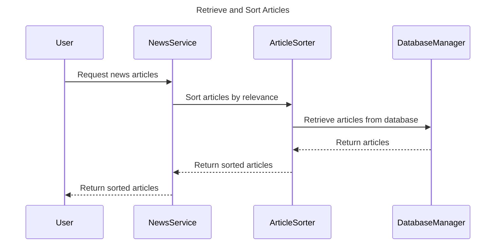

Java Method:

```java
public List<Article> getSortedArticles() {
    List<Article> articles = databaseManager.retrieveArticles();
    List<Article> sortedArticles = articleSorter.sortArticles(articles);
    return sortedArticles;
}
```

## Sequence Diagram 2

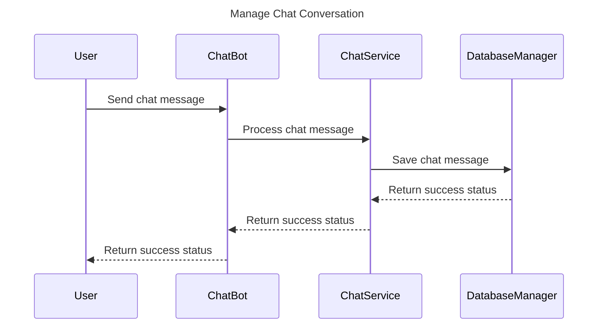

Java Method:

```java
public boolean saveChatMessage(String message) {
    boolean success = chatService.processMessage(message);
    if (success) {
        boolean saved = databaseManager.saveMessage(message);
        return saved;
    }
    return false;
}
```

## Sequence Diagram 3

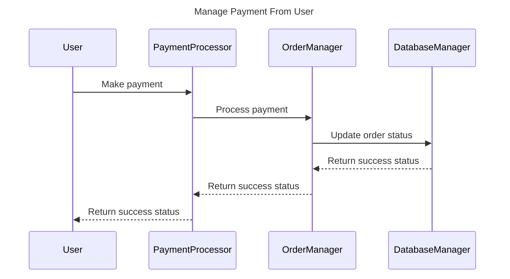

Java Method:

```java
public boolean processPayment(double amount) {
    boolean success = paymentProcessor.makePayment(amount);
    if (success) {
        boolean updated = orderManager.updateOrderStatus();
        return updated;
    }
    return false;
}
```

## Sequence Diagram 4

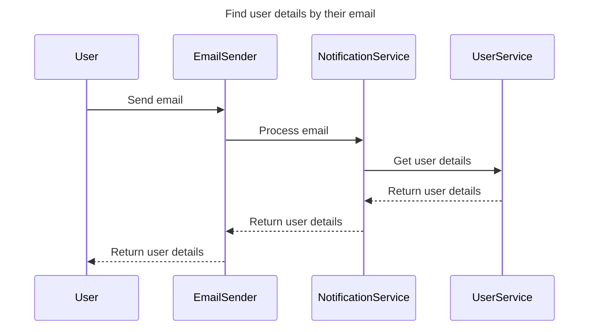

Java Method:

```java
public User getUserDetailsForEmail(String email) {
    User user = userService.getUserByEmail(email);
    if (user != null) {
        boolean sent = emailSender.sendEmail(user.getEmail());
        if (sent) {
            return user;
        }
    }
    return null;
}
```

## Sequence Diagram 5

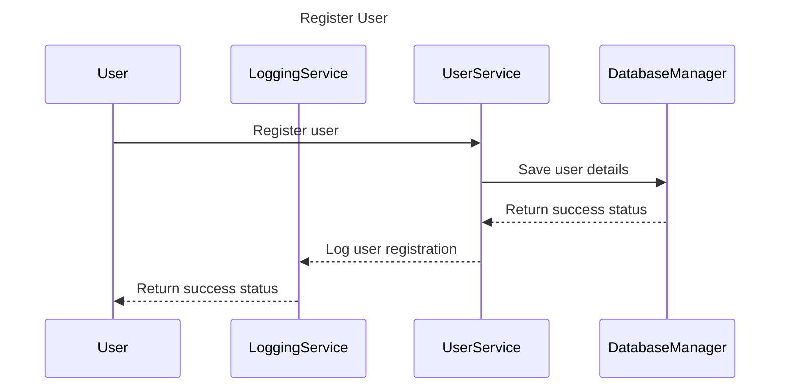

Java Method:

```java
public boolean registerUser(User user) {
    boolean saved = databaseManager.saveUser(user);
    if (saved) {
        boolean logged = userService.logUserRegistration(user);
        return logged;
    }
    return false;
}
```

# Now let's generate five Mermaid sequence diagrams from different Java methods.

## Java Method 1

```java
public void processOrder(Order order) {
    boolean validated = validationService.validateOrder(order);
    if (validated) {
        boolean processed = orderProcessor.processOrder(order);
        if (processed) {
            emailService.sendOrderConfirmation(order);
        }
    }
}
```

Sequence Diagram:

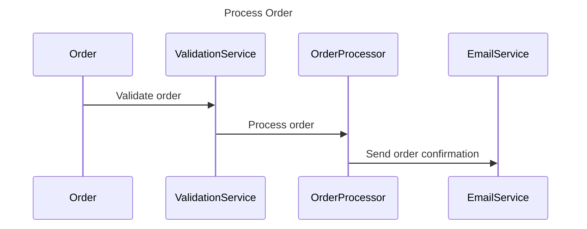

## Java Method 2

```java
public void generateReport(String reportType) {
    Report report = reportGenerator.generate(reportType);
    if (report != null) {
        fileUploader.upload(report);
        emailService.sendReport(report);
    }
}
```

Sequence Diagram:

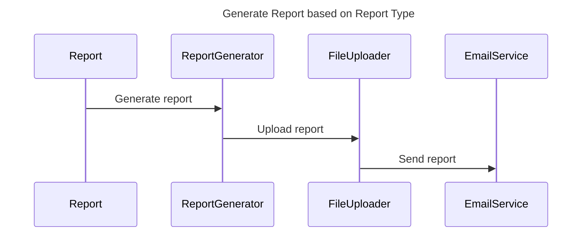

## Java Method 3

```java
public void processPayment(double amount) {
    boolean authorized = paymentService.authorizePayment(amount);
    if (authorized) {
        boolean processed = paymentProcessor.processPayment(amount);
        if (processed) {
            notificationService.sendPaymentConfirmation(amount);
        }
    }
}
```

Sequence Diagram:

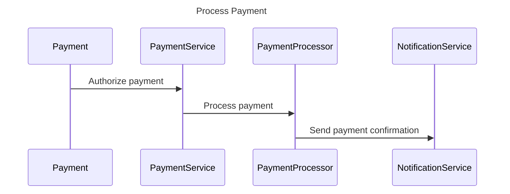

## Java Method 4

```java
public void processChatMessage(ChatMessage message) {
    boolean filtered = chatFilter.filterMessage(message);
    if (filtered) {
        boolean processed = chatProcessor.processMessage(message);
        if (processed) {
            chatHistory.saveMessage(message);
        }
    }
}
```

Sequence Diagram:

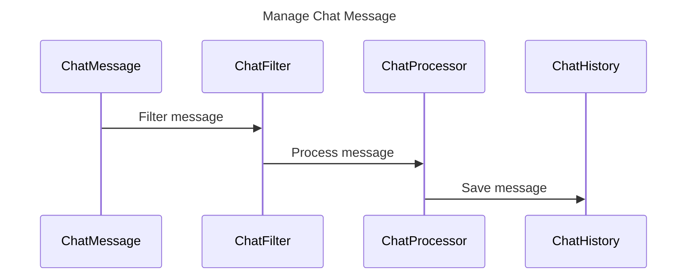

## Java Method 5

```java
public void processImage(Image image) {
    Image processedImage = imageProcessor.process(image);
    if (processedImage != null) {
        fileUploader.upload(processedImage);
        notificationService.sendImageProcessedNotification(processedImage);
    }
}
```

Sequence Diagram:

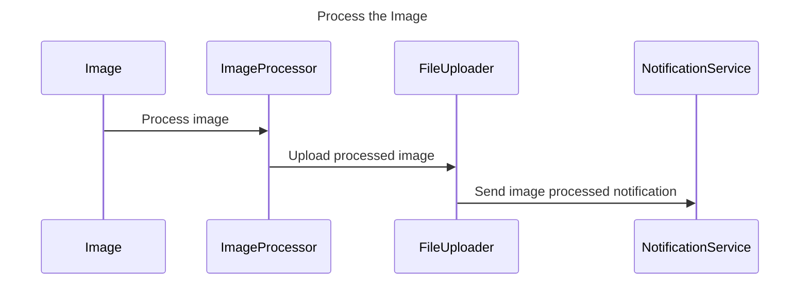

# Error Handling Example:

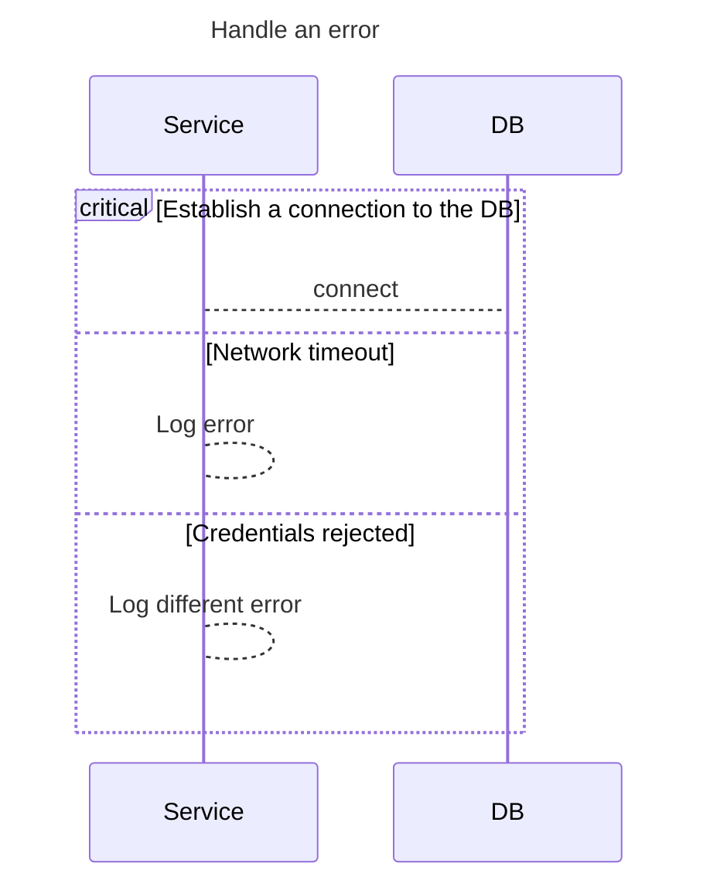

# Show critical alt and opt example 


## Java example for  critical alt and opt example
```java
class HRService {
    ...

    public void updateEmployeesManager(final Employee employee, final Manager manager) {
        if (!employee.isNew()) {
            hRWorkflow.initiateManagerChangeWorkflow(employee, manager);
        } else {
            try {
                repo.updateManager(employee, manager);
            } catch (EmployeeRepoException hrRepoException) {
                logger.log(Level.SEVERE, "Unable to handle update employee operations",
                        hrRepoException);
            }
        }
    }
}
```

## Mermaid example for critical, alt and option example


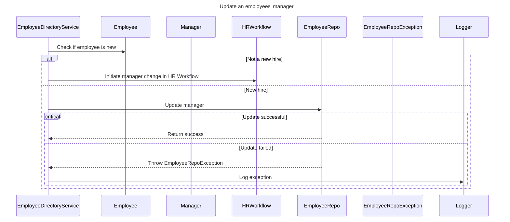

Note alt syntax is alt/else/end.
Note that critical syntax is critical/option/end.


---


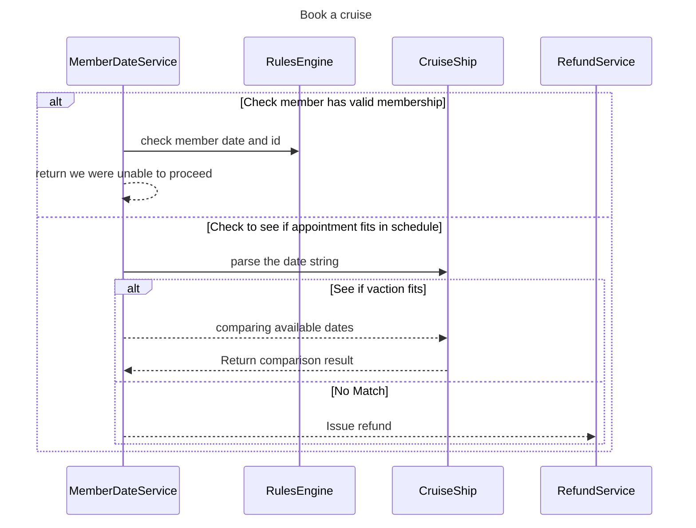


# Example toString

## Input Java 

```java

public class Person {

    ...

    @Override
    public String toString() {
        StringBuilder sb = new StringBuilder();
        sb.append("Person{");
        sb.append("firstName='").append(firstName).append('\'');
        sb.append(", lastName='").append(lastName).append('\'');
        sb.append(", workEmail='").append(workEmail).append('\'');
        sb.append(", email='").append(email).append('\'');
        sb.append(", address=").append(address);
        sb.append('}');
        return sb.toString();
    }

}

```
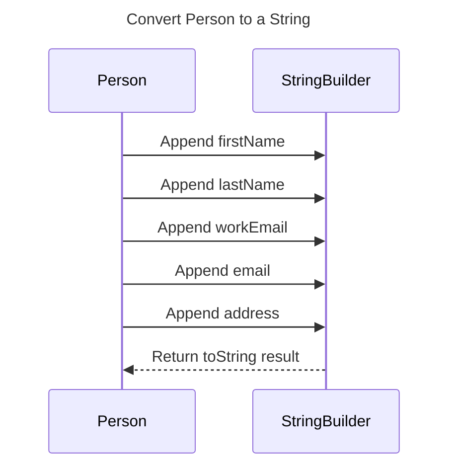


