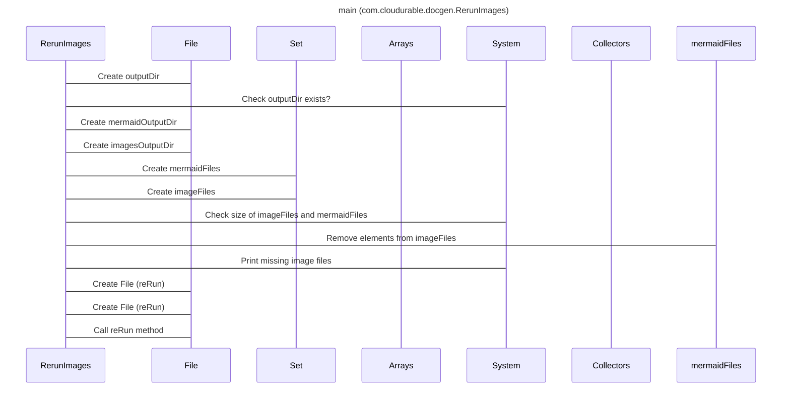

----
# ORIGINAL RESPONSE 
# Participants
- RerunImages
- File
- Set
- Arrays
- System
- Collectors

# Initial Interactions
- RerunImages creates a new File `outputDir` using the value from `args` (if provided) or the current directory.
- RerunImages checks if the `outputDir` exists.
- RerunImages creates a new File `mermaidOutputDir` as a child of `outputDir` with the name "mermaid".
- RerunImages creates a new File `imagesOutputDir` as a child of `outputDir` with the name "images".
- RerunImages creates a new Set `mermaidFiles` by:
  - Listing the files in `mermaidOutputDir`.
  - Getting the names of the files.
  - Removing the file extension from each name.
  - Collecting the names into a Set.
- RerunImages creates a new Set `imageFiles` by:
  - Listing the files in `imagesOutputDir`.
  - Getting the names of the files.
  - Removing the file extension from each name.
  - Collecting the names into a Set.

# Clean Interactions
- RerunImages creates a new File `outputDir` using the value from `args` if provided or the current directory.
- RerunImages checks if the `outputDir` exists.
- RerunImages creates a new File `mermaidOutputDir` as a child of `outputDir` with the name "mermaid".
- RerunImages creates a new File `imagesOutputDir` as a child of `outputDir` with the name "images".
- RerunImages creates a new Set `mermaidFiles` by listing the files in `mermaidOutputDir`, getting the names of the files, removing the file extension from each name, and collecting the names into a Set.
- RerunImages creates a new Set `imageFiles` by listing the files in `imagesOutputDir`, getting the names of the files, removing the file extension from each name, and collecting the names into a Set.
- RerunImages checks if the size of `imageFiles` is not equal to the size of `mermaidFiles`.
- RerunImages removes all elements from `mermaidFiles` that are also present in `imageFiles`.
- RerunImages prints the names of the missing image files by iterating over `mermaidFiles` and displaying the corresponding image file names.
- RerunImages iterates over `mermaidFiles` and `reRun` each file by:
  - Creating a new File by appending the file name with the ".mmd" extension (from `mermaidOutputDir`) and a new File by appending the file name with the ".png" extension (from `imagesOutputDir`).
  - Calling the `reRun` method with these two File objects.

# Final Participants
- RerunImages
  - [ ] RerunImages creates a new File `outputDir` using the value from `args` (if provided) or the current directory.
  - [ ] RerunImages checks if the `outputDir` exists.
  - [ ] RerunImages creates a new File `mermaidOutputDir` as a child of `outputDir` with the name "mermaid".
  - [ ] RerunImages creates a new File `imagesOutputDir` as a child of `outputDir` with the name "images".
  - [ ] RerunImages creates a new Set `mermaidFiles` by listing the files in `mermaidOutputDir`, getting the names of the files, removing the file extension from each name, and collecting the names into a Set.
  - [ ] RerunImages creates a new Set `imageFiles` by listing the files in `imagesOutputDir`, getting the names of the files, removing the file extension from each name, and collecting the names into a Set.
  - [ ] RerunImages checks if the size of `imageFiles` is not equal to the size of `mermaidFiles`.
  - [ ] RerunImages removes all elements from `mermaidFiles` that are also present in `imageFiles`.
  - [ ] RerunImages prints the names of the missing image files by iterating over `mermaidFiles` and displaying the corresponding image file names.
  - [ ] RerunImages iterates over `mermaidFiles` and `reRun` each file by creating a new File by appending the file name with the ".mmd" extension (from `mermaidOutputDir`) and a new File by appending the file name with the ".png" extension (from `imagesOutputDir`) and calling the `reRun` method with these two File objects.
- File
- Set
- Arrays
- System
- Collectors

# Plain English Title
main (com.cloudurable.docgen.RerunImages)

# Mermaid Sequence Diagram
