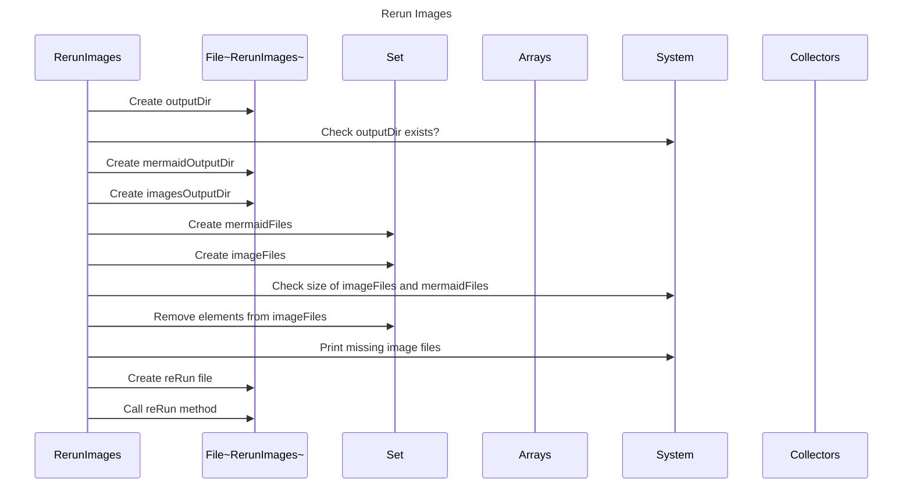

----
# FIX RAW RESPONSE 3
# Final Participants

* RerunImages
* File
* Set
* Arrays
* System
* Collectors

# Validation Fixes

1. Remove any primitive or basic data types as participants in the sequence diagram. Replace `File` with `File~RerunImages~`.
2. Fix the description in the interactions by removing any method calls. Update `Create File (reRun)` to `Create File`.
3. Remove any duplicate participants in the sequence diagram. Remove the second `File` participant.

# Interaction After Fix

1. `RerunImages` creates `outputDir`.
2. `RerunImages` checks if `outputDir` exists in `System`.
3. `RerunImages` creates `mermaidOutputDir`.
4. `RerunImages` creates `imagesOutputDir`.
5. `RerunImages` creates `mermaidFiles`.
6. `RerunImages` creates `imageFiles`.
7. `RerunImages` checks the size of `imageFiles` and `mermaidFiles`.
8. `RerunImages` removes elements from `imageFiles` that are also in `mermaidFiles`.
9. `RerunImages` prints missing image files in `System`.
10. `RerunImages` creates `reRun` file.
11. `RerunImages` calls `reRun` method.

# Final Participants

* RerunImages
* File~RerunImages~
* Set
* Arrays
* System
* Collectors

# Plain English Title

Rerun Images

# Mermaid Sequence Diagram

