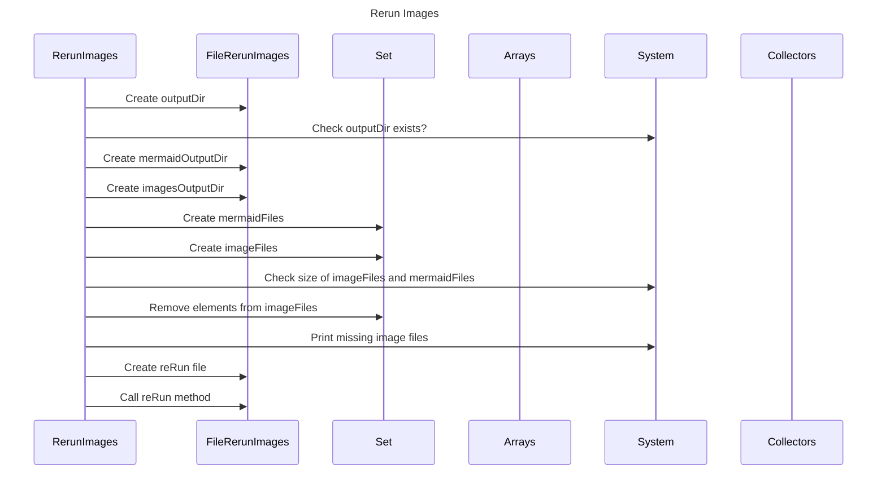

----
# FIX RAW RESPONSE 2
# Participants
1. RerunImages
2. File~RerunImages~
3. Set
4. Arrays
5. System
6. Collectors

# Validation Fixes
- Line 6: Replace `File~RerunImages~` with `FileRerunImages`.
- Line 12: Replace `File~RerunImages~` with `FileRerunImages`.
- Line 14: Replace `File~RerunImages~` with `FileRerunImages`.
- Line 15: Replace `File~RerunImages~` with `FileRerunImages`.
- Line 21: Replace `File~RerunImages~` with `FileRerunImages`.
- Line 22: Replace `File~RerunImages~` with `FileRerunImages`.

# Interaction After Fix
1. RerunImages creates outputDir.
2. RerunImages checks if outputDir exists.
3. RerunImages creates mermaidOutputDir.
4. RerunImages creates imagesOutputDir.
5. RerunImages creates mermaidFiles Set.
6. RerunImages creates imageFiles Set.
7. RerunImages checks the size of imageFiles and mermaidFiles.
8. RerunImages removes elements from imageFiles.
9. RerunImages prints missing image files.
10. RerunImages creates reRun file.
11. RerunImages calls reRun method.

# Final Participants

1. RerunImages
2. FileRerunImages
3. Set
4. Arrays
5. System
6. Collectors

# Plain English Title
Rerun Images

# Mermaid Sequence Diagram

