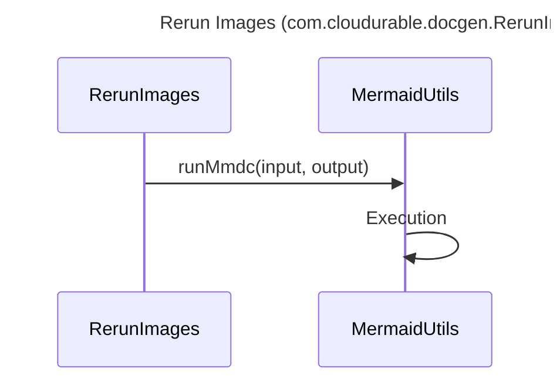

----
# ORIGINAL RESPONSE 
# Participants

* RerunImages
* MermaidUtils
* File

# Initial Interactions

1. RerunImages invokes `MermaidUtils.runMmdc()` passing the `input` and `output` File objects as arguments.

# Clean Interactions

1. RerunImages invokes `MermaidUtils.runMmdc()`.
2. MermaidUtils receives the `input` and `output` File objects as parameters from RerunImages.
3. MermaidUtils executes the `runMmdc()` method.

# Final Participants

* RerunImages
  * Clean Interactions: 1-3
* MermaidUtils
  * Clean Interactions: 2-3
* File
  * Clean Interactions: None (REMOVE)

# Plain English Title

Rerun Images (com.cloudurable.docgen.RerunImages)

# Mermaid Sequence Diagram

