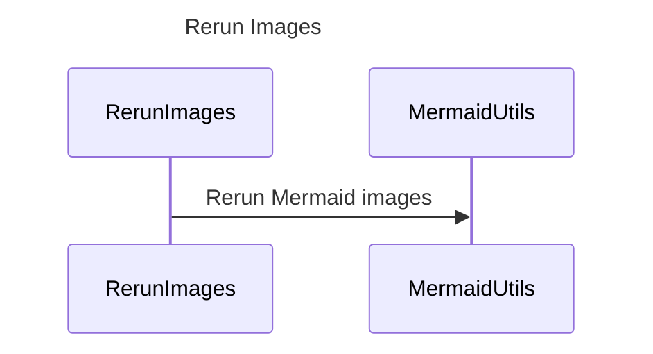

----
# FIX RAW RESPONSE 3
# Participants

1. RerunImages
2. MermaidUtils

# Validation Fixes
1. Rule Name: No Method Calls In Descriptions Rule
   - Issue: Method call in description: `runMmdc(input, output)`
   - Fix: Remove method call from description

# Interaction After Fix

1. RerunImages ->> MermaidUtils: Rerun Mermaid images

# Final Participants

1. RerunImages
2. MermaidUtils

# Plain English Title

Rerun Images

# Mermaid Sequence Diagram

