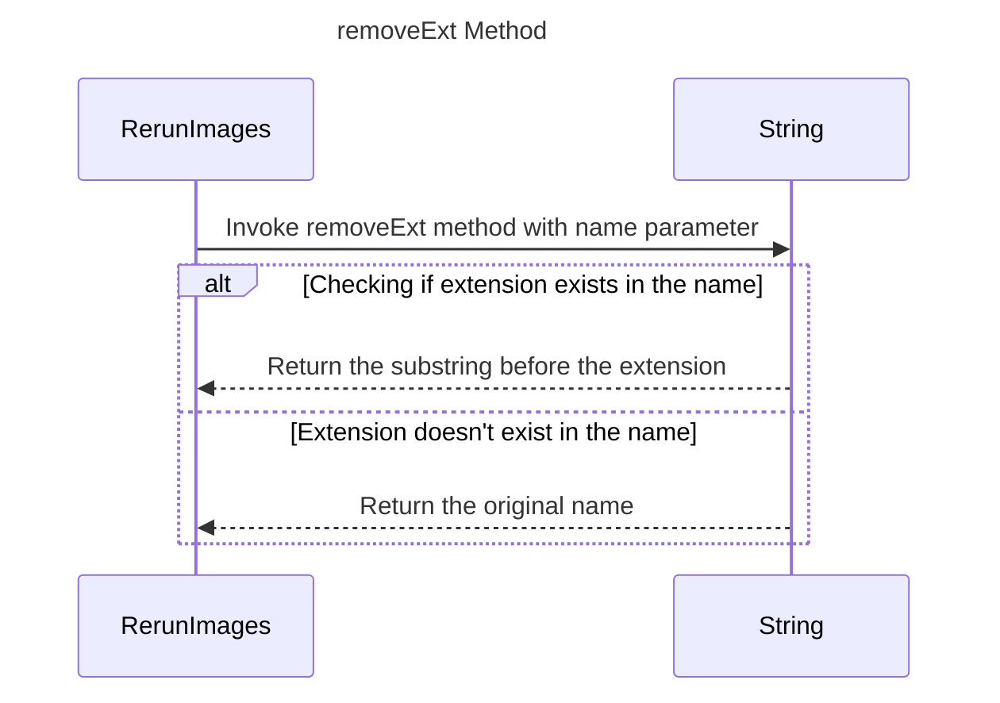

----
# ORIGINAL RESPONSE 
# Participants

1. RerunImages
2. String

# Initial Interactions

RerunImages invokes the `removeExt` method by passing a String `name` as a parameter.

# Clean Interactions

1. RerunImages->>String: Invoke removeExt method with name parameter
2. alt Checking if extension exists in the name
      String-->>RerunImages: Return the substring before the extension
    else Extension doesn't exist in the name
      String-->>RerunImages: Return the original name
    end

# Final Participants

- RerunImages
  - Invoke removeExt method with name parameter
- String
  - Return the substring before the extension
  - Return the original name

# Plain English Title

removeExt Method

# Mermaid Sequence Diagram

