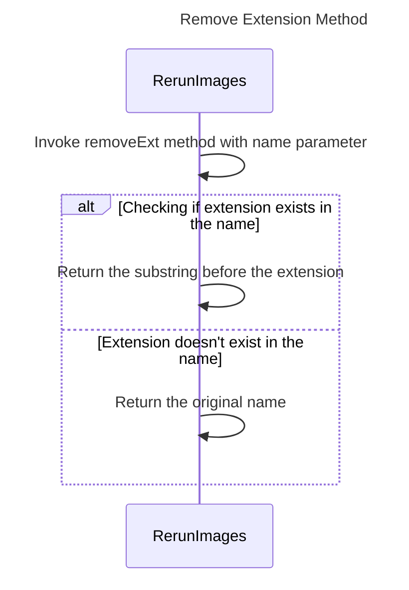

----
# FIX RAW RESPONSE 3
# Participants
- RerunImages (com.cloudurable.docgen.RerunImages)
- String

# Validation Fixes
- Remove `String` as a participant due to it being a basic data type.

# Interaction After Fix
1. RerunImages invokes the `removeExt` method with the `name` parameter.
2. If an extension exists in the name, the substring before the extension is returned.
3. If an extension does not exist in the name, the original name is returned.

# Final Participants
- RerunImages (com.cloudurable.docgen.RerunImages)

# Plain English Title
Remove Extension Method

# Mermaid Sequence Diagram

