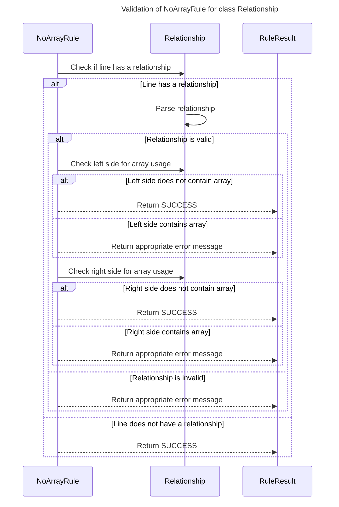

----
# FIX RAW RESPONSE 1
# Participants

* NoArrayRule
* LineRule
* Pattern
* Relationship
* RuleResult

# Validation Fixes

1. RuleName: Require Title
   - Provide a title for the sequence diagram. For example:
   ```
   ---
   title: Generating toString
   ---
   ```

2. RuleName: MermaidImageGen
   - Fix the issue with the Mermaid image generator.

# Interaction After Fix

1. Check if the line has a relationship:
   - If the line does not have a relationship, return RuleResult.SUCCESS.
   - If the line has a relationship, parse the relationship and check if it is valid.

2. Check the left side of the relationship for array usage:
   - If the left side does not contain an array, return RuleResult.SUCCESS.
   - If the left side contains an array, return a RuleResult with the appropriate error message.

3. Check the right side of the relationship for array usage:
   - If the right side does not contain an array, return RuleResult.SUCCESS.
   - If the right side contains an array, return a RuleResult with the appropriate error message.

# Final Participants

* NoArrayRule (start)
* Relationship
* RuleResult

# Plain English Title

Validation of NoArrayRule for class Relationship

# Mermaid Sequence Diagram


