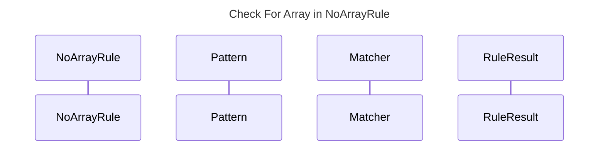

----
# FIX RAW RESPONSE 1
# Participants
Desired participants:
1. NoArrayRule
2. Pattern
3. Matcher
4. RuleResult

# Validation Fixes
1. Rule: `Require Title`
   - Fix: Add a title to the mermaid sequence diagram.
   - Description: The mermaid sequence diagram must have a title in the specific format `title: Title Text`.

2. Rule: `MermaidImageGen`
   - Fix: Ensure the mermaid image generator is functioning correctly.
   - Description: The mermaid image generator failed to generate an image for the mermaid code. Ensure that the generator is installed and configured properly.

# Interaction After Fix
No interaction description provided.

# Final Participants
1. NoArrayRule
2. Pattern
3. Matcher
4. RuleResult

# Plain English Title
Check For Array in NoArrayRule

# Mermaid Sequence Diagram
