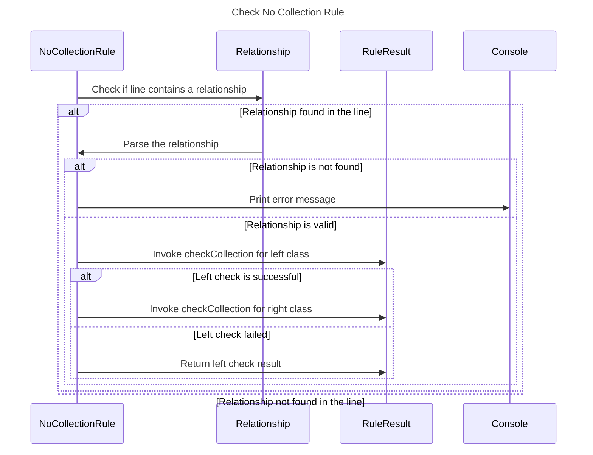

----
# FIX RAW RESPONSE 1
# Participants

1. NoCollectionRule
2. Relationship
3. RuleResult
4. Console

# Validation Fixes

1. Remove `Throwable` participant.
2. Update interaction description to plain English for all interactions.
3. Add missing `end` after `alt` block.

# Interaction After Fix

1NoCollectionRule->>Relationship: Check if line contains a relationship

alt Relationship found in the line
    Relationship->>1NoCollectionRule: Parse the relationship

    alt Relationship is not found
        1NoCollectionRule->>Console: Print error message
    else Relationship is valid
        1NoCollectionRule->>RuleResult: Invoke checkCollection for left class

        alt Left check is successful
            1NoCollectionRule->>RuleResult: Invoke checkCollection for right class
        else Left check failed
            1NoCollectionRule->>RuleResult: Return left check result
        end

    end
else Relationship not found in the line

# Final Participants

1. NoCollectionRule
2. Relationship
3. RuleResult
4. Console

# Plain English Title

Check No Collection Rule

# Mermaid Sequence Diagram

