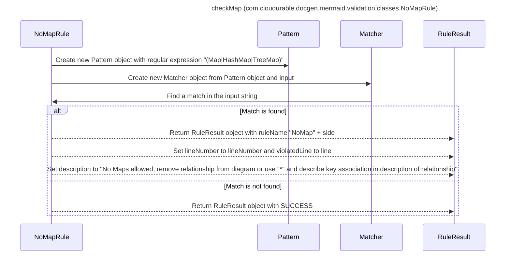

----
# ORIGINAL RESPONSE 
# Participants

- `NoMapRule`
- `Pattern`
- `Matcher`
- `RuleResult`

# Initial Interactions

1. `NoMapRule` creates a new `Pattern` object using the regular expression `"(Map|HashMap|TreeMap)"`.
2. `NoMapRule` defines a method `checkMap` which takes in parameters `side`, `input`, `line`, `lineNumber`.
3. `checkMap` method creates a new `Matcher` object by invoking the `matcher` method on the `Pattern` object and passing in the `input`.
4. `checkMap` method checks if the `Matcher` object finds a match in the `input` string.
5. If a match is found, `checkMap` method returns a `RuleResult` object with the following properties:
   - `ruleName` set to `"NoMap" + side"`
   - `lineNumber` set to the `lineNumber` parameter
   - `violatedLine` set to the `line` parameter
   - `description` set to "No Maps allowed, remove relationship from diagram or use \"*\" and describe key association in description of relationship".
6. If no match is found, `checkMap` method returns a `RuleResult` object with `SUCCESS`.

# Clean Interactions

1. `NoMapRule`->>`Pattern`: Create new `Pattern` object with regular expression `"(Map|HashMap|TreeMap)"`
2. `NoMapRule`->>`Matcher`: Create new `Matcher` object from `Pattern` object and `input`
3. `Matcher`->>`NoMapRule`: Find a match in the `input` string
4. `alt` Match is found
   1. `NoMapRule`-->>`RuleResult`: Return `RuleResult` object with `ruleName` "NoMap" + side
   2. `NoMapRule`-->>`RuleResult`: Set `lineNumber` to `lineNumber` and `violatedLine` to `line`
   3. `NoMapRule`-->>`RuleResult`: Set `description` to "No Maps allowed, remove relationship from diagram or use \"*\" and describe key association in description of relationship"
5. `else` Match is not found
   1. `NoMapRule`-->>`RuleResult`: Return `RuleResult` object with `SUCCESS`
6. `end`

# Final Participants

- `NoMapRule`
   - `NoMapRule->>Pattern`
   - `NoMapRule->>Matcher`
   - `NoMapRule-->>RuleResult`

# Plain English Title

"checkMap (com.cloudurable.docgen.mermaid.validation.classes.NoMapRule)"

# Mermaid Sequence Diagram

