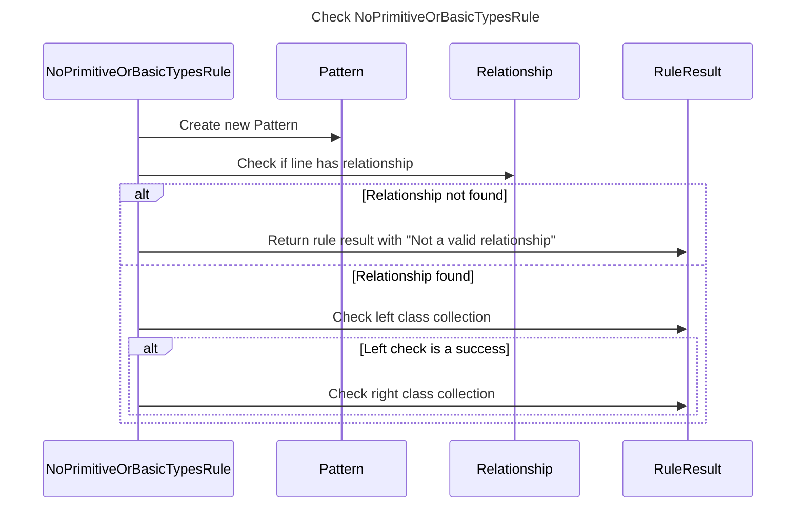

----
# ORIGINAL RESPONSE 
# Participants

1. NoPrimitiveOrBasicTypesRule
2. Pattern
3. Relationship
4. RuleResult

# Initial Interactions

- NoPrimitiveOrBasicTypesRule creates a new Pattern with the regex pattern.
- NoPrimitiveOrBasicTypesRule checks if the line has a relationship using the Relationship class.
- NoPrimitiveOrBasicTypesRule checks if the relationship is not found.
- NoPrimitiveOrBasicTypesRule calls checkCollection with "Left", the left class of the relationship, the line, and the line number.
- NoPrimitiveOrBasicTypesRule checks if the left check is a success.
- If the left check is a success, NoPrimitiveOrBasicTypesRule calls checkCollection with "Right", the right class of the relationship, the line, and the line number.

# Clean Interactions

- NoPrimitiveOrBasicTypesRule creates a new Pattern with the regex pattern.
- NoPrimitiveOrBasicTypesRule checks if the line has a relationship using the Relationship class.
- NoPrimitiveOrBasicTypesRule checks if the relationship is not found.
- NoPrimitiveOrBasicTypesRule calls checkCollection with "Left", the left class of the relationship, the line, and the line number.
- NoPrimitiveOrBasicTypesRule checks if the left check is a success.
- If the left check is a success, NoPrimitiveOrBasicTypesRule calls checkCollection with "Right", the right class of the relationship, the line, and the line number.

# Final Participants

- NoPrimitiveOrBasicTypesRule
  - NoPrimitiveOrBasicTypesRule creates a new Pattern with the regex pattern.
  - NoPrimitiveOrBasicTypesRule checks if the line has a relationship using the Relationship class.
  - NoPrimitiveOrBasicTypesRule checks if the relationship is not found.
  - NoPrimitiveOrBasicTypesRule calls checkCollection with "Left", the left class of the relationship, the line, and the line number.
  - NoPrimitiveOrBasicTypesRule checks if the left check is a success.
  - If the left check is a success, NoPrimitiveOrBasicTypesRule calls checkCollection with "Right", the right class of the relationship, the line, and the line number.

# Plain English Title

Check NoPrimitiveOrBasicTypesRule

# Mermaid Sequence Diagram

