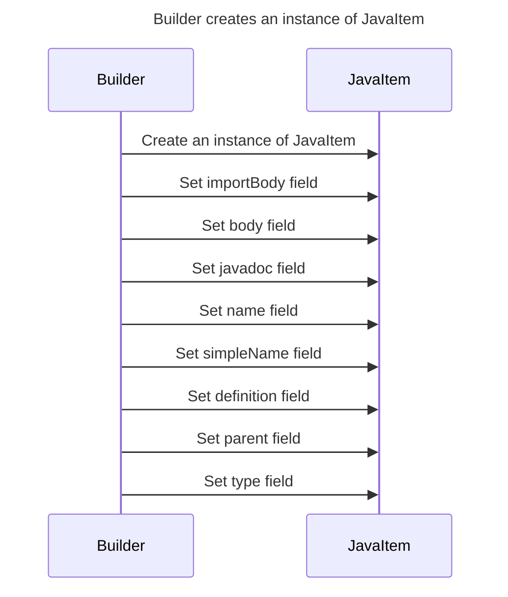

----
# ORIGINAL RESPONSE 
# Participants

* Builder
* Parent

# Initial Interactions

* Builder creates an instance of JavaItem
* JavaItem class has importBody, body, javadoc, name, simpleName, definition, parent, and type fields

# Clean Interactions

* Builder creates an instance of JavaItem
* JavaItem class has importBody, body, javadoc, name, simpleName, definition, parent, and type fields

# Final Participants

* Builder
  * Instance of JavaItem
* JavaItem
  * importBody
  * body
  * javadoc
  * name
  * simpleName
  * definition
  * parent
  * type

# Plain English Title

Builder creates an instance of JavaItem and sets its fields

# Mermaid Sequence Diagram

