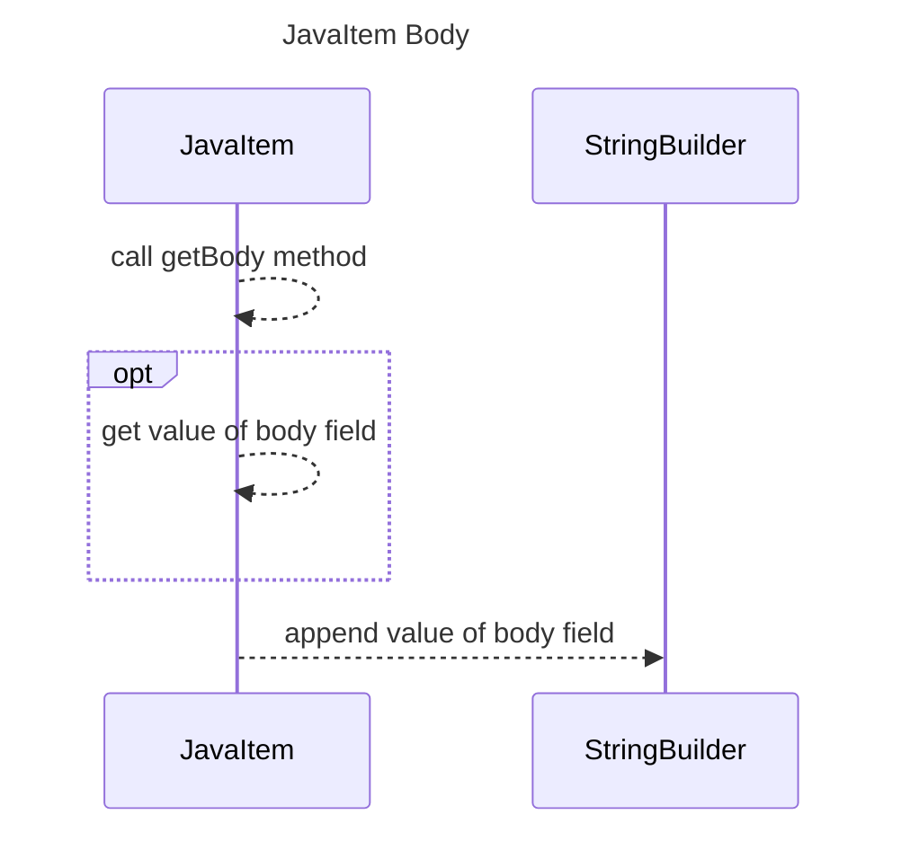

----
# ORIGINAL RESPONSE 
# Participants

- JavaItem
- StringBuilder

# Initial Interactions

JavaItem calls `getBody()` method of JavaItem class.
JavaItem calls `body` field.
JavaItem returns the value of `body` field.

# Clean Interactions

JavaItem calls `getBody` method
JavaItem returns the value of `body` field

# Final Participants

- JavaItem
  - JavaItem calls `getBody` method
  - JavaItem returns the value of `body` field
- StringBuilder
  - StringBuilder appends the value of `body` field

# Plain English Title

JavaItem Body

# Mermaid Sequence Diagram

