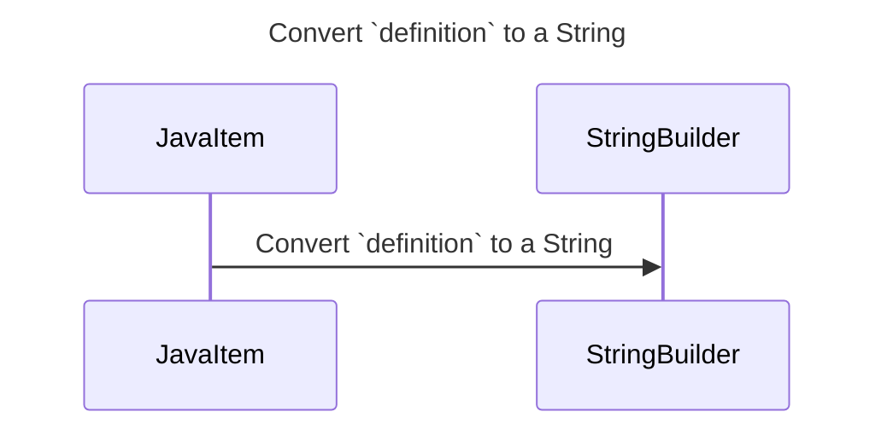

----
# ORIGINAL RESPONSE 
# Participants

1. JavaItem
2. StringBuilder

# Initial Interactions

- JavaItem calls `getDefinition()` method.

# Clean Interactions

- JavaItem ->> StringBuilder: Convert `definition` to a String.

# Final Participants

- JavaItem
  - Interaction: JavaItem calls `getDefinition()` method.
- StringBuilder
  - Interaction: JavaItem -> StringBuilder: Convert `definition` to a String.

# Plain English Title

Convert `definition` to a String

# Mermaid Sequence Diagram

