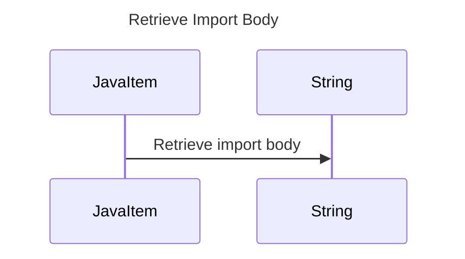

----
# ORIGINAL RESPONSE 
# Participants

* JavaItem
* String

# Initial Interactions

JavaItem -> String: getImportBody()

# Clean Interactions

JavaItem -> String: Retrieve import body

# Final Participants

* JavaItem
  * Retrieve import body

# Plain English Title

Retrieve Import Body

# Mermaid Sequence Diagram

