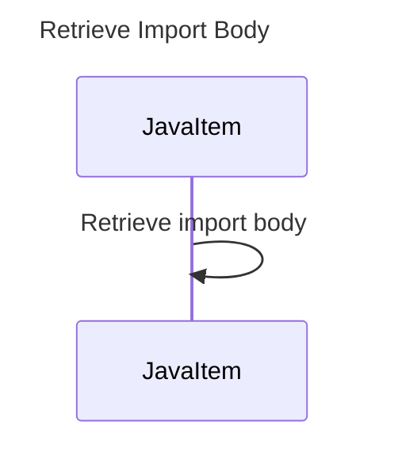

----
# FIX RAW RESPONSE 3
# Participants
Based on the provided code, the participants in the sequence diagram for the `getImportBody` method would be:
- JavaItem

# Validation Fixes
- Remove the participant `String` as it is a primitive or basic data type, which is not allowed as a participant in the sequence diagram.

# Interaction After Fix
There is only one interaction in the method, which is a simple retrieval of the import body from the `JavaItem`.

# Final Participants
Based on the fixes, the final participants in the sequence diagram for the `getImportBody` method would be:
- JavaItem

# Plain English Title
The plain English title for the sequence diagram would be: "Retrieve Import Body"

# Mermaid Sequence Diagram

