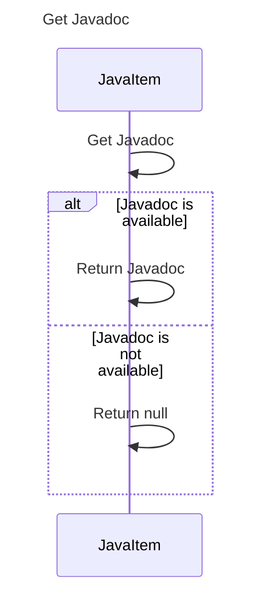

----
# ORIGINAL RESPONSE 
# Participants

1. JavaItem
2. JavaItemType

# Initial Interactions

- JavaItem->>JavaItem: Get Javadoc

# Clean Interactions

- alt Javadoc is available
    - JavaItem->>JavaItem: Return Javadoc
else Javadoc is not available
    - JavaItem->>JavaItem: Return null
end

# Final Participants

- JavaItem
  - Get Javadoc

# Plain English Title

Get Javadoc

# Mermaid Sequence Diagram

