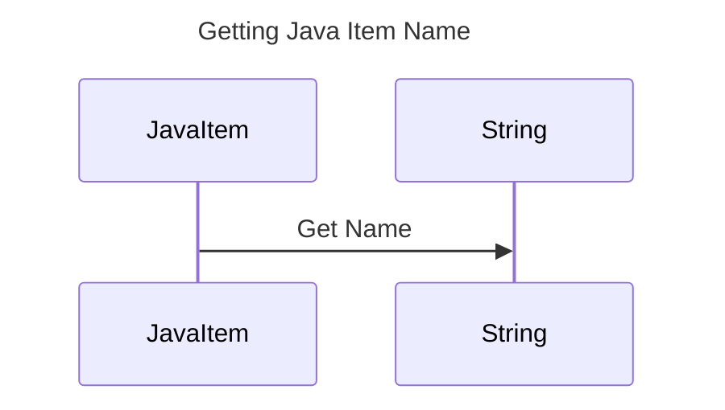

----
# ORIGINAL RESPONSE 
# Participants
- JavaItem
- String

# Initial Interactions
- JavaItem has a method `getName()` that returns a String.

# Clean Interactions
- JavaItem->>String: Get Name

# Final Participants
- JavaItem
  - JavaItem->>String: Get Name

# Plain English Title
Getting Java Item Name

# Mermaid Sequence Diagram
