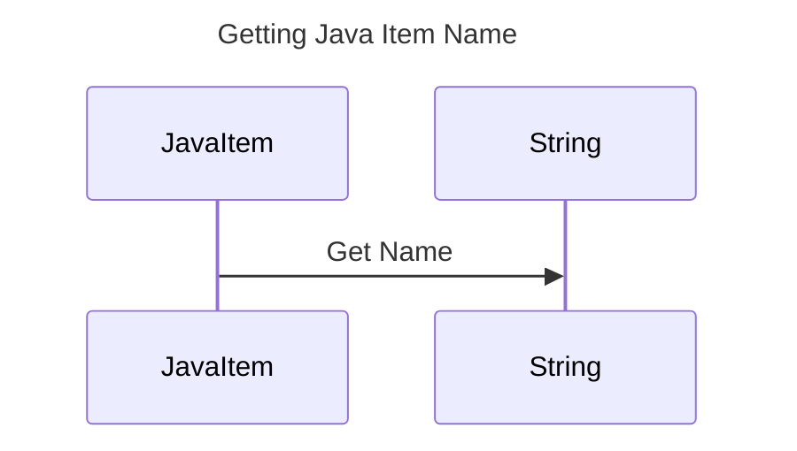

----
# FIX RAW RESPONSE 3
# Participants
- JavaItem
- String

# Validation Fixes
1. Remove `String` from participants as it is a basic data type.
2. Replace `:` with `~` in participant names, i.e., `List<Employee>` to `List~Employee~`.

# Interaction After Fix
1. JavaItem->>String: Get Name

# Final Participants
- JavaItem

# Plain English Title
Getting Java Item Name

# Mermaid Sequence Diagram

