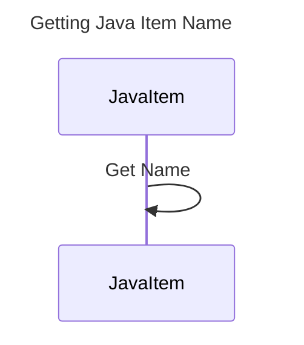

----
# FIX RAW RESPONSE 2
# Participants

Participants used in the mermaid sequence diagram:
- JavaItem
- String

# Validation Fixes

The issue raised in the validation is that the participant "String" should not be included in the sequence diagram. To fix this, I will remove "String" from the list of participants.

# Interaction After Fix

Interaction list with fixes applied:
- JavaItem->>String: Get Name

# Final Participants

Participants after fixing the validation issue:
- JavaItem

# Plain English Title

"Getting Java Item Name"

# Mermaid Sequence Diagram

