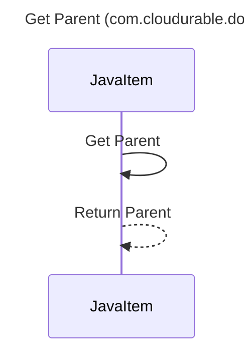

----
# ORIGINAL RESPONSE 
# Participants

* JavaItem
* JavaItemType

# Initial Interactions

1. JavaItem calls `getParent()` method.
2. JavaItem returns the parent object.

# Clean Interactions

1. JavaItem->JavaItem: Get Parent
2. JavaItem->>JavaItem: Return Parent

# Final Participants

* JavaItem
  * JavaItem->JavaItem

# Plain English Title

Get Parent (com.cloudurable.docgen.parser.model.JavaItem)

# Mermaid Sequence Diagram

