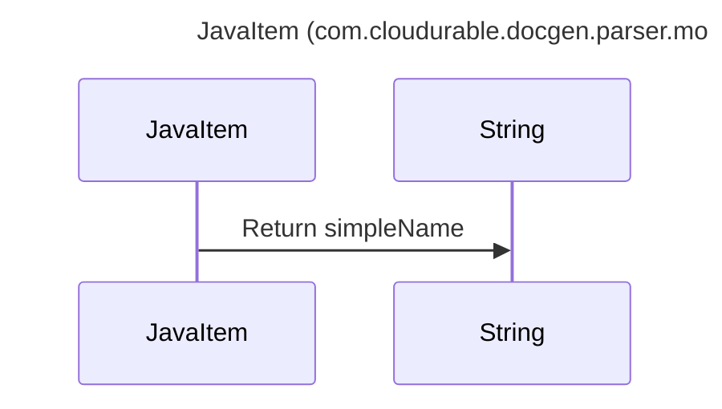

----
# ORIGINAL RESPONSE 
# Participants

1. JavaItem
2. String

# Initial Interactions

JavaItem -> String: Return simpleName

# Clean Interactions

JavaItem ->> String: Return simpleName

# Final Participants

- JavaItem
   - JavaItem -> String: Return simpleName
   
- String
   - JavaItem -> String: Return simpleName

# Plain English Title

JavaItem (com.cloudurable.docgen.parser.model.JavaItem)

# Mermaid Sequence Diagram

