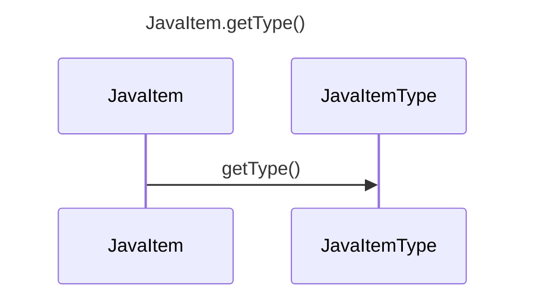

----
# ORIGINAL RESPONSE 
# Participants

* JavaItem
* JavaItemType

# Initial Interactions

JavaItem.getType() method call:
* JavaItemType getType()

# Clean Interactions

JavaItem.getType() method call:
* JavaItem->>JavaItemType: getType()

# Final Participants

- JavaItem
    - JavaItem->>JavaItemType: getType()

# Plain English Title

JavaItem.getType()

# Mermaid Sequence Diagram

