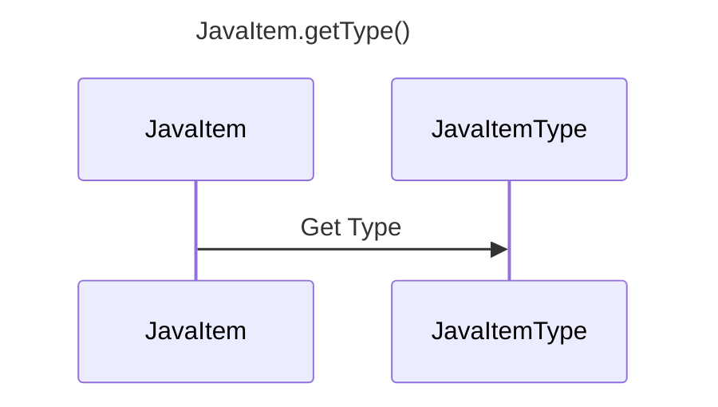

----
# FIX RAW RESPONSE 3
# Participants

Participants:
- JavaItem
- JavaItemType

# Validation Fixes

No fixes required.

# Interaction After Fix

Interaction:
- JavaItem ->> JavaItemType: Get Type

# Final Participants

Participants:
- JavaItem
- JavaItemType

# Plain English Title

JavaItem.getType

# Mermaid Sequence Diagram

