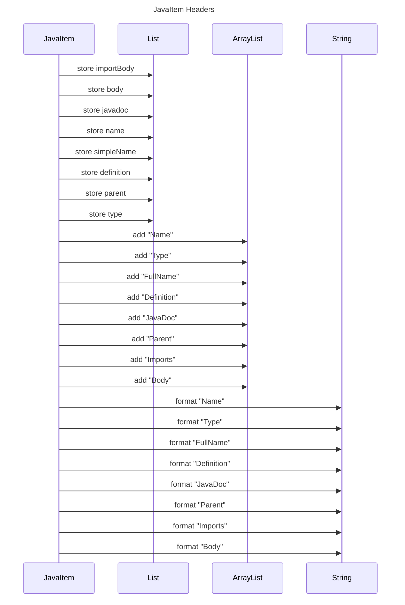

----
# ORIGINAL RESPONSE 
# Participants

1. JavaItem
2. List
3. ArrayList
4. String

# Initial Interactions

* JavaItem -> List: 
* JavaItem -> ArrayList: 
* JavaItem -> String: 

# Clean Interactions

* JavaItem -> List~importBody~: store importBody
* JavaItem -> List~body~: store body
* JavaItem -> List~javadoc~: store javadoc
* JavaItem -> List~name~: store name
* JavaItem -> List~simpleName~: store simpleName
* JavaItem -> List~definition~: store definition
* JavaItem -> List~parent~: store parent
* JavaItem -> List~type~: store type
* JavaItem -> ArrayList~add~: add "Name"
* JavaItem -> ArrayList~add~: add "Type"
* JavaItem -> ArrayList~add~: add "FullName"
* JavaItem -> ArrayList~add~: add "Definition"
* JavaItem -> ArrayList~add~: add "JavaDoc"
* JavaItem -> ArrayList~add~: add "Parent"
* JavaItem -> ArrayList~add~: add "Imports"
* JavaItem -> ArrayList~add~: add "Body"
* JavaItem -> String~format~: format "Name"
* JavaItem -> String~format~: format "Type"
* JavaItem -> String~format~: format "FullName"
* JavaItem -> String~format~: format "Definition"
* JavaItem -> String~format~: format "JavaDoc"
* JavaItem -> String~format~: format "Parent"
* JavaItem -> String~format~: format "Imports"
* JavaItem -> String~format~: format "Body"

# Final Participants

* JavaItem
  * JavaItem -> List: 
  * JavaItem -> ArrayList: 
  * JavaItem -> String: 

# Plain English Title

JavaItem Headers

# Mermaid Sequence Diagram

