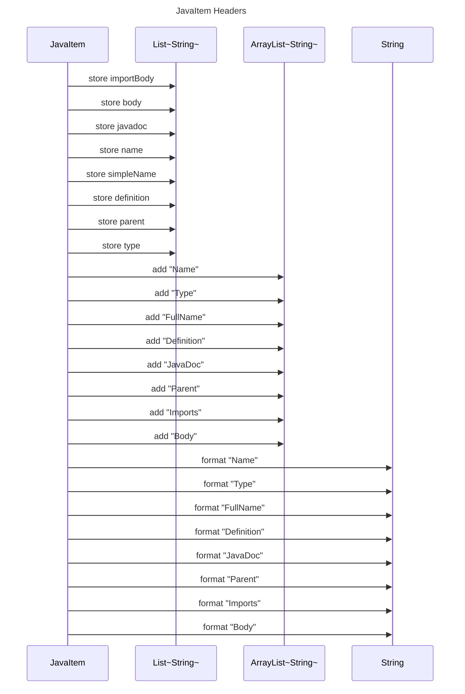

----
# FIX RAW RESPONSE 3
# Participants
The list of participants identified from the given code snippet consists of:
- JavaItem
- List
- ArrayList
- String

# Validation Fixes
After reviewing the validation issues, here's how each issue will be fixed:
1. Remove the participant `String` as it violates the rule of including primitive or basic data types as participants.
2. Replace `List` with `List~String~` to adhere to the guidelines of avoiding angle brackets in participant names.
3. Replace `ArrayList` with `ArrayList~String~` to follow the same guidelines as above.
4. Update the violated lines in the validation JSON accordingly.

# Interaction After Fix
The interaction between the participants can be described as follows:
1. `JavaItem` interacts with `List~String~` by storing different data attributes, including name, type, full name, definition, JavaDoc, parent, imports, and body.
2. `JavaItem` also interacts with `ArrayList~String~` by adding the above-mentioned data attributes to the list.
3. `JavaItem` formats each data attribute using `String` by appending the attribute name to the format method.

# Final Participants
The updated list of participants after applying the fixes includes:
- JavaItem
- List~String~
- ArrayList~String~

# Plain English Title
The plain English title for this sequence diagram would be "JavaItem Headers".

# Mermaid Sequence Diagram

