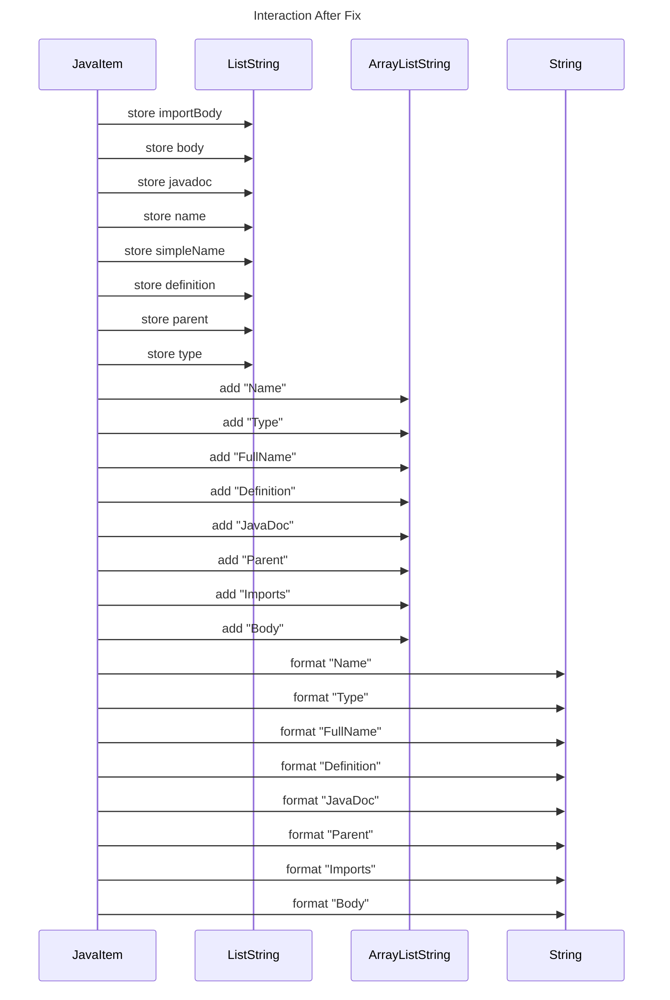

----
# FIX RAW RESPONSE 2
# Participants

1. JavaItem
2. List~String~
3. ArrayList~String~

# Validation Fixes
1. Rename `List~String~` to `ListString`
2. Rename `ArrayList~String~` to `ArrayListString`

# Interaction After Fix

# Final Participants

1. JavaItem
2. ListString
3. ArrayListString

# Plain English Title

"JavaItem Headers"

# Mermaid Sequence Diagram

