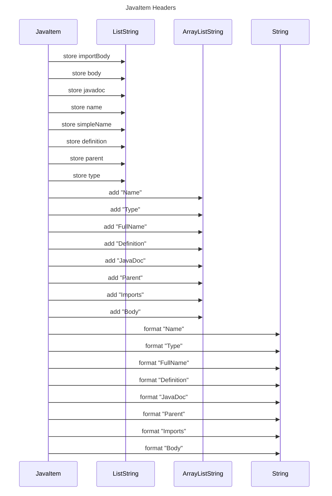

----
# FIX RAW RESPONSE 1
# Validation Fixes
Based on the validation errors, the following fixes will be applied:

1. Remove any participants that are primitive or basic data types.
2. Replace angle brackets with tilde "~" in participant names.
3. Remove colons (":") from participant names.

# Participants After Fix
The updated list of participants after applying the fixes is as follows:
- JavaItem
- ListString
- ArrayListString

# Interaction After Fix
The list of interactions between participants after applying the fixes is as follows:

1. JavaItem stores importBody in ListString.
2. JavaItem stores body in ListString.
3. JavaItem stores javadoc in ListString.
4. JavaItem stores name in ListString.
5. JavaItem stores simpleName in ListString.
6. JavaItem stores definition in ListString.
7. JavaItem stores parent in ListString.
8. JavaItem stores type in ListString.
9. JavaItem adds "Name" to ArrayListString.
10. JavaItem adds "Type" to ArrayListString.
11. JavaItem adds "FullName" to ArrayListString.
12. JavaItem adds "Definition" to ArrayListString.
13. JavaItem adds "JavaDoc" to ArrayListString.
14. JavaItem adds "Parent" to ArrayListString.
15. JavaItem adds "Imports" to ArrayListString.
16. JavaItem adds "Body" to ArrayListString.
17. JavaItem formats "Name" as a String.
18. JavaItem formats "Type" as a String.
19. JavaItem formats "FullName" as a String.
20. JavaItem formats "Definition" as a String.
21. JavaItem formats "JavaDoc" as a String.
22. JavaItem formats "Parent" as a String.
23. JavaItem formats "Imports" as a String.
24. JavaItem formats "Body" as a String.

# Final Participants
The final list of participants, considering only participants used in the interaction flow, is as follows:
- JavaItem
- ListString
- ArrayListString

# Plain English Title
"JavaItem Headers"

# Mermaid Sequence Diagram
