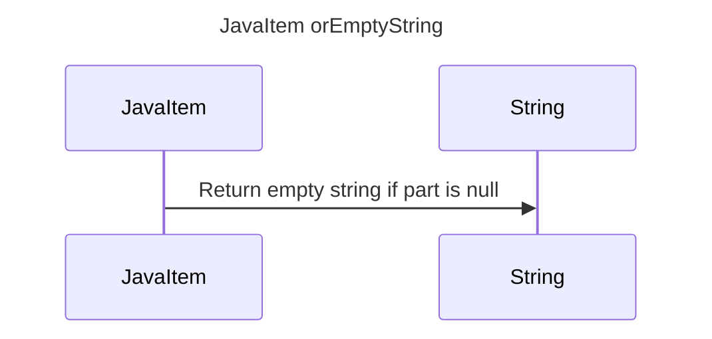

----
# ORIGINAL RESPONSE 
# Participants
- JavaItem
- String

# Initial Interactions
- JavaItem -> String: Check if part is null
- String -> JavaItem: Return empty string if part is null

# Clean Interactions
- JavaItem -> String: Return empty string if part is null

# Final Participants
- JavaItem
  - JavaItem -> String

# Plain English Title
JavaItem orEmptyString

# Mermaid Sequence Diagram
