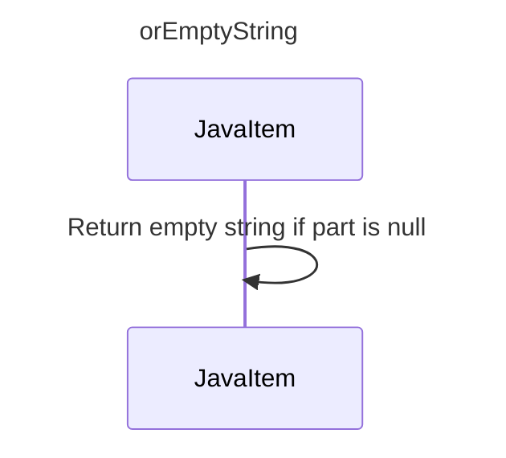

----
# FIX RAW RESPONSE 3
# Participants

1. JavaItem
2. String

# Validation Fixes

1. Remove the participant `String` from the sequence diagram.

# Interaction After Fix

1. JavaItem->>JavaItem: Return empty string if part is null

# Final Participants

1. JavaItem

# Plain English Title

orEmptyString

# Mermaid Sequence Diagram

