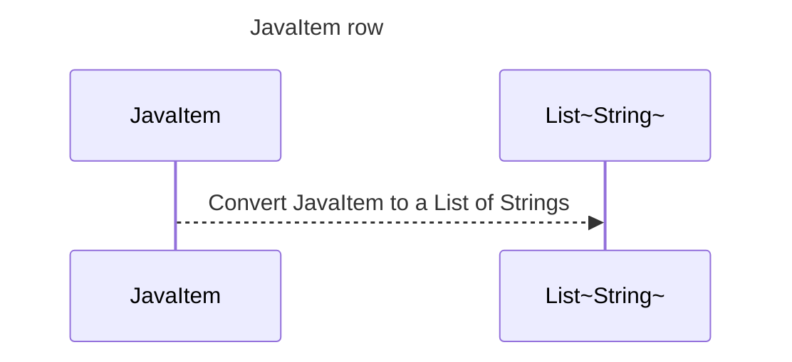

----
# ORIGINAL RESPONSE 
# Participants
- JavaItem
- String
- List~String~

# Initial Interactions
- JavaItem -> List~String~: Call row method

# Clean Interactions
- JavaItem ->> List~String~: Convert JavaItem to a List of Strings

# Final Participants
- JavaItem
  - Convert JavaItem to a List of Strings

# Plain English Title
JavaItem row

# Mermaid Sequence Diagram
