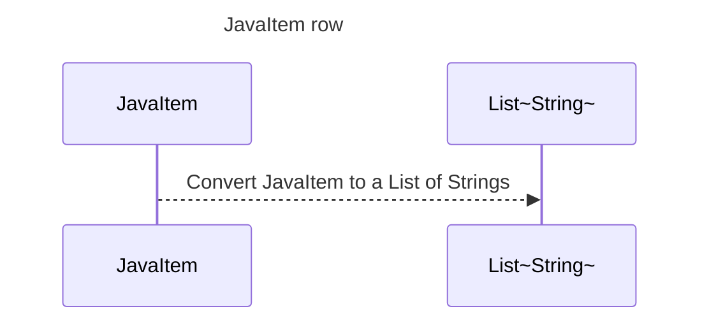

----
# FIX RAW RESPONSE 3
# Participants

1. `JavaItem` (Class)
2. `List~String~` (Class)

# Validation Fixes

1. Remove the participant `List~String~` from the participant list, as it is a basic data type (`List`) and should not be included.
2. Replace the angle brackets (`<>`) in the participant `List~String~` with tildes (`~`).

# Interaction After Fix

- `JavaItem` converts itself into a `List` of `Strings`.

# Final Participants

1. `JavaItem` (Class)

# Plain English Title

JavaItem row

# Mermaid Sequence Diagram

