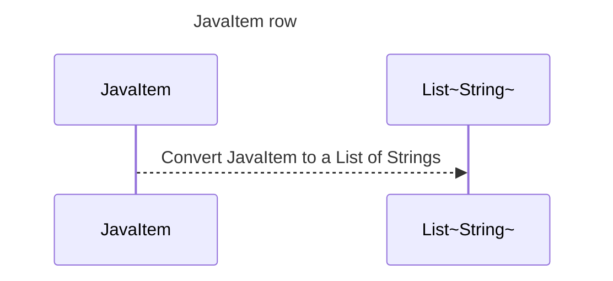

----
# FIX RAW RESPONSE 2
# Participants

- JavaItem
- List~String~

# Validation Fixes

None

# Interaction After Fix

None

# Final Participants

- JavaItem

# Plain English Title

JavaItem row

# Mermaid Sequence Diagram

