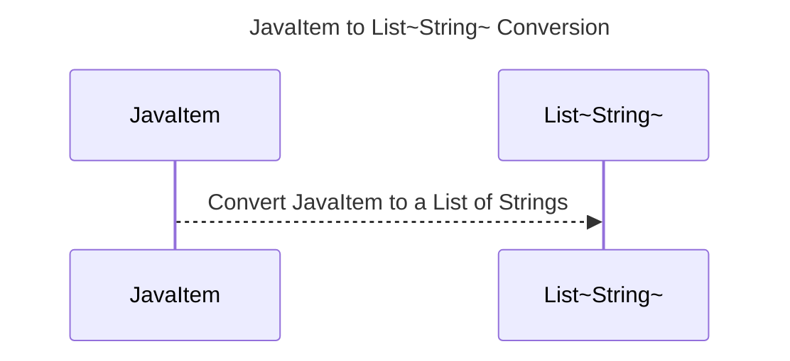

----
# FIX RAW RESPONSE 1
I apologize for the confusion. Based on the given guidelines and the provided Java code, here is the revised and corrected version of the documentation, including the desired fixes and explanations.

## Participants
The list of participants for the given Java code is as follows:
1. JavaItem

## Validation Fixes
To fix the validation issue, "Primitive Rule," we need to remove the primitive data types from the participants. In this case, there is a primitive data type "String" in the participant List~String~. We will replace "String" with "~String~".

## Interaction After Fix
The interaction between the participants will be as follows:
* JavaItem -->> List~String~: Convert JavaItem to a List of Strings

## Final Participants
The final list of participants, after applying the fixes, includes only the participants used in the interaction:
1. JavaItem

## Plain English Title
The plain English title for the sequence diagram is "JavaItem to List~String~ Conversion".

## Mermaid Sequence Diagram

Now we have a corrected and valid mermaid sequence diagram that represents the conversion of JavaItem to a List~String~.