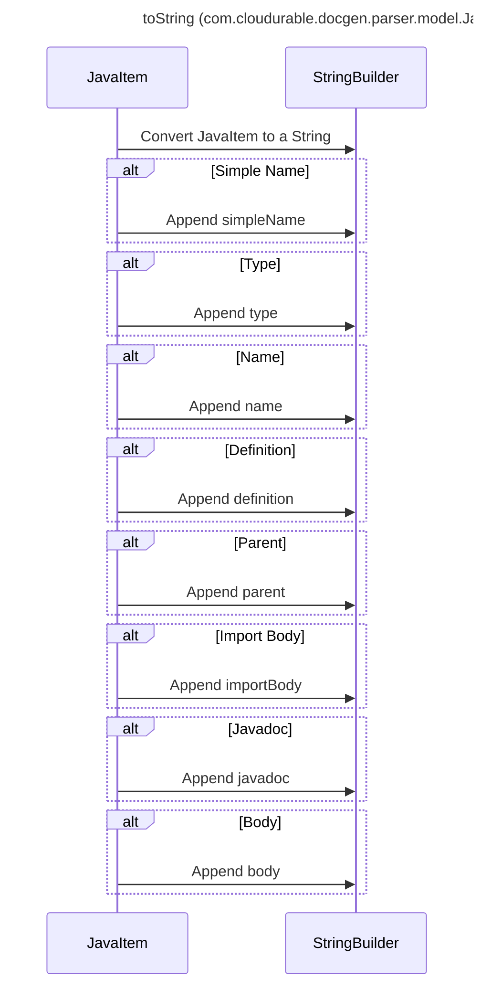

----
# ORIGINAL RESPONSE 
# Participants

- JavaItem
- StringBuilder

# Initial Interactions

JavaItem calls toString() to convert itself to a string representation.
StringBuilder appends the simpleName of JavaItem.
StringBuilder appends the type of JavaItem.
StringBuilder appends the name of JavaItem.
StringBuilder appends the definition of JavaItem.
StringBuilder appends the parent of JavaItem.
StringBuilder appends the importBody of JavaItem.
StringBuilder appends the javadoc of JavaItem.
StringBuilder appends the body of JavaItem.

# Clean Interactions

JavaItem->>StringBuilder: Convert JavaItem to a String

alt Simple Name
    JavaItem->>StringBuilder: Append simpleName
end

alt Type
    JavaItem->>StringBuilder: Append type
end

alt Name
    JavaItem->>StringBuilder: Append name
end

alt Definition
    JavaItem->>StringBuilder: Append definition
end

alt Parent
    JavaItem->>StringBuilder: Append parent
end

alt Import Body
    JavaItem->>StringBuilder: Append importBody
end

alt Javadoc
    JavaItem->>StringBuilder: Append javadoc
end

alt Body
    JavaItem->>StringBuilder: Append body
end

# Final Participants

- JavaItem
    - StringBuilder
- StringBuilder

# Plain English Title

toString (com.cloudurable.docgen.parser.model.JavaItem)

# Mermaid Sequence Diagram

