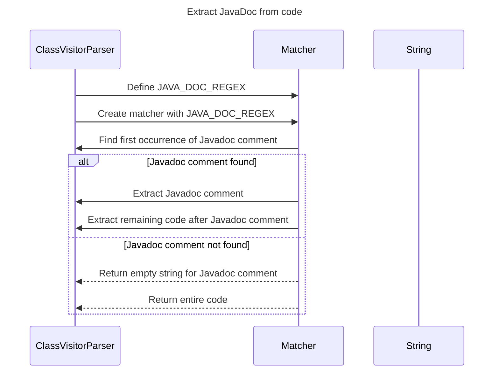

----
# ORIGINAL RESPONSE 
# Participants

1. ClassVisitorParser
2. Matcher
3. String

# Initial Interactions

1. ClassVisitorParser receives the `extractJavaDoc` code as input.
2. `JAVA_DOC_REGEX` pattern is defined to match Javadoc comments.
3. `matcher` matches the Javadoc comments in the code.
4. If Javadoc comment is found, the comment and the remaining code are extracted.
5. If no Javadoc comment is found, an empty string and the entire code are returned.

# Clean Interactions

1. ClassVisitorParser receives the `extractJavaDoc` code as input.
2. ClassVisitorParser defines a regular expression pattern (`JAVA_DOC_REGEX`) to match Javadoc comments.
3. ClassVisitorParser creates a `matcher` to match Javadoc comments using the `JAVA_DOC_REGEX` pattern.
4. ClassVisitorParser finds the first occurrence of a Javadoc comment using the `matcher` in the code.
5. If a Javadoc comment is found, the comment and the remaining code after the comment are extracted.
6. If no Javadoc comment is found, an empty string and the entire code are returned.

# Final Participants

- ClassVisitorParser
  - Interaction 1
  - Interaction 2
  - Interaction 3
  - Interaction 4
  - Interaction 5

# Plain English Title

Extract JavaDoc from code

# Mermaid Sequence Diagram

