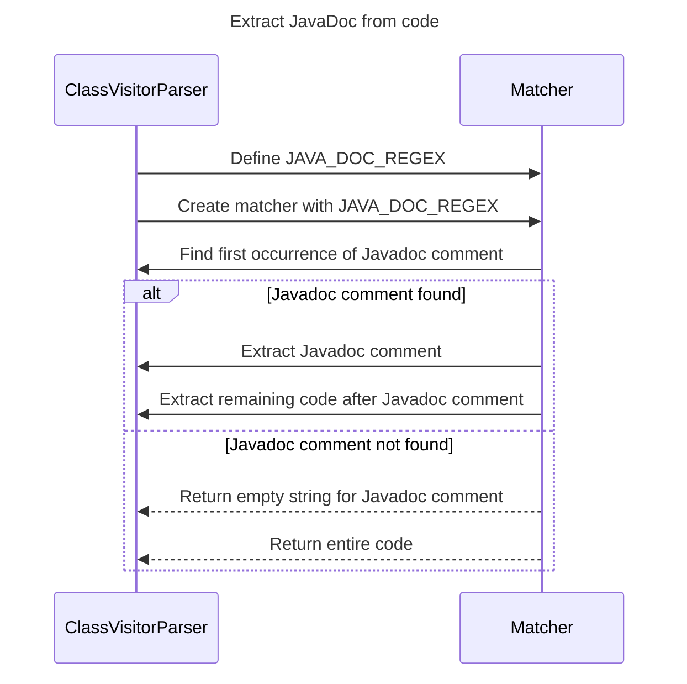

----
# FIX RAW RESPONSE 3
# Participants

1. ClassVisitorParser
2. Matcher

# Validation Fixes

- The participant "String" violates the primitive rule. Replace it with a more descriptive participant.

# Interaction After Fix

1. ClassVisitorParser -> Matcher: Define JAVA_DOC_REGEX
2. ClassVisitorParser -> Matcher: Create matcher with JAVA_DOC_REGEX
3. Matcher -> ClassVisitorParser: Find first occurrence of Javadoc comment
4. alt Javadoc comment found
   1. Matcher -> ClassVisitorParser: Extract Javadoc comment
   2. Matcher -> ClassVisitorParser: Extract remaining code after Javadoc comment
5. else Javadoc comment not found
   1. Matcher -->> ClassVisitorParser: Return empty string for Javadoc comment
   2. Matcher -->> ClassVisitorParser: Return entire code
6. end

# Final Participants

1. ClassVisitorParser
2. Matcher

# Plain English Title

Extract JavaDoc from code

# Mermaid Sequence Diagram

