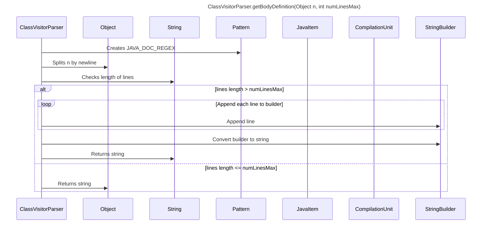

----
# ORIGINAL RESPONSE 
# Participants

* `ClassVisitorParser`
* `Object`
* `String`
* `Pattern`
* `JavaItem`
* `CompilationUnit`
* `StringBuilder`

# Initial Interactions

1. `ClassVisitorParser` has a field `javaItems` of type `List<JavaItem>`.
2. `ClassVisitorParser` has a field `compilationUnit` of type `CompilationUnit`.
3. `ClassVisitorParser` has a method `getBodyDefinition(Object n, int numLinesMax)` that takes an `Object` parameter `n` and an `int` parameter `numLinesMax`.

# Clean Interactions

1. `ClassVisitorParser` creates a `Pattern` object using `JAVA_DOC_REGEX`.
2. `ClassVisitorParser` splits the string representation of `n` by newline and assigns it to the `lines` array.
3. If the length of `lines` is greater than `numLinesMax`, `ClassVisitorParser` creates a `StringBuilder` object named `builder`.
4. `ClassVisitorParser` appends each line from `lines` to `builder` followed by a newline character.
5. `ClassVisitorParser` increments the `count` variable by 1.
6. If `count` is greater than or equal to 200, the loop breaks.
7. `ClassVisitorParser` converts `builder` to a string and returns it.
8. If the length of `lines` is not greater than `numLinesMax`, `ClassVisitorParser` returns the string representation of `n`.

# Final Participants

* `ClassVisitorParser`
  * Interactions: 1, 2, 3, 4, 5, 6, 7, 8
* `Object`
  * Interactions: 3
* `String`
  * Interactions: 3, 6
* `Pattern`
  * Interactions: 1
* `JavaItem`
  * Interactions: 1
* `CompilationUnit`
  * Interactions: 2
* `StringBuilder`
  * Interactions: 4, 5

# Plain English Title

`ClassVisitorParser.getBodyDefinition(Object n, int numLinesMax)`

# Mermaid Sequence Diagram

