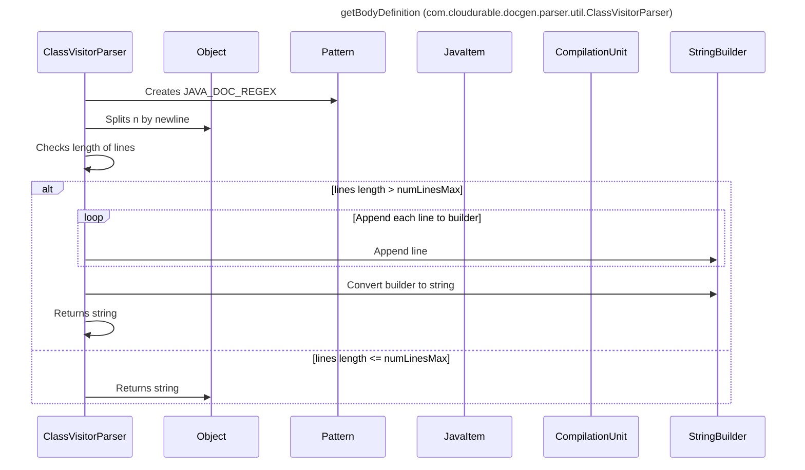

----
# FIX RAW RESPONSE 3
## Participants

- ClassVisitorParser
- Object
- Pattern
- JavaItem
- CompilationUnit
- StringBuilder

## Validation Fixes

- In line 7, remove `String` as a participant and replace it with `ClassVisitorParser`.
- In line 15, remove `String` as a participant and replace it with `ClassVisitorParser`.
- In line 21, remove `String` as a participant and replace it with `ClassVisitorParser`.

## Interaction After Fix

- ClassVisitorParser creates JAVA_DOC_REGEX.
- ClassVisitorParser splits n by newline.
- ClassVisitorParser checks length of lines.
  - If lines length is greater than numLinesMax, append each line to a StringBuilder, convert the builder to a string, and return the string.
  - If lines length is less than or equal to numLinesMax, return n.toString().

## Final Participants

- ClassVisitorParser
- Object
- Pattern
- JavaItem
- CompilationUnit
- StringBuilder

## Plain English Title

getBodyDefinition

## Mermaid Sequence Diagram

