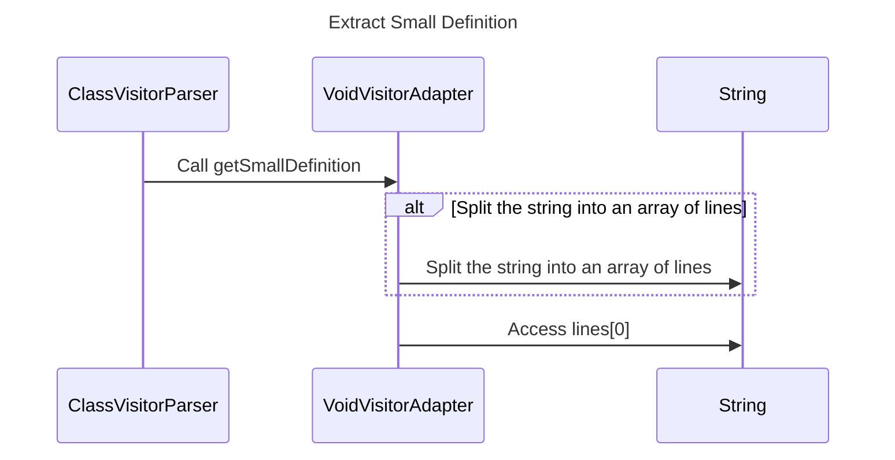

----
# ORIGINAL RESPONSE 
# Participants

* ClassVisitorParser
* VoidVisitorAdapter
* Pattern
* List<JavaItem>
* CompilationUnit
* String

# Initial Interactions

* ClassVisitorParser -> VoidVisitorAdapter: Call getSmallDefinition()

# Clean Interactions

* ClassVisitorParser -> VoidVisitorAdapter: Call getSmallDefinition
* VoidVisitorAdapter -> String: Split the string into an array of lines
* VoidVisitorAdapter -> String: Access lines[0]

# Final Participants

* ClassVisitorParser
  * Clean Interactions: ClassVisitorParser -> VoidVisitorAdapter: Call getSmallDefinition
* VoidVisitorAdapter
  * Initial Interactions: ClassVisitorParser -> VoidVisitorAdapter: Call getSmallDefinition
  * Clean Interactions: VoidVisitorAdapter -> String: Split the string into an array of lines, VoidVisitorAdapter -> String: Access lines[0]
* Pattern
* List<JavaItem>
* CompilationUnit
* String

# Plain English Title

Extract Small Definition

# Mermaid Sequence Diagram

