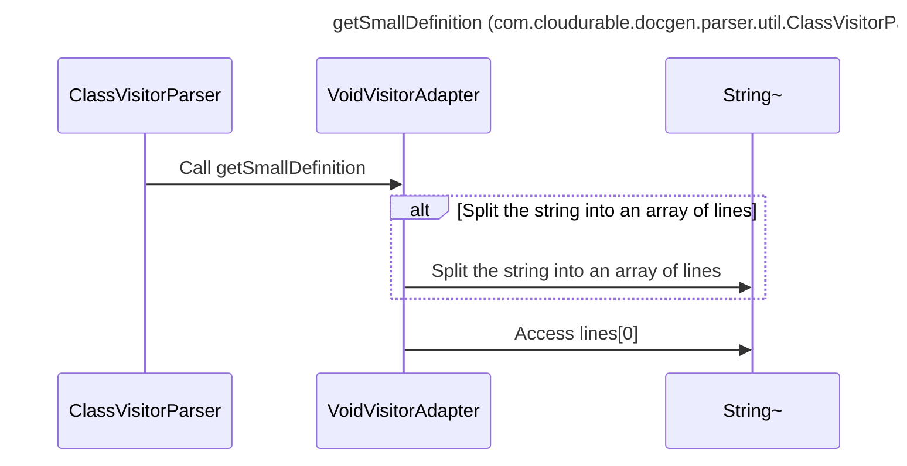

----
# FIX RAW RESPONSE 3
# Participants
- ClassVisitorParser
- VoidVisitorAdapter
- String

# Validation Fixes
1. Primitive Rule violation on line 7: Replace "String" with "String~"
2. Primitive Rule violation on line 11: Replace "String" with "String~"
3. Primitive Rule violation on line 13: Replace "String" with "String~"

# Interaction After Fix
- ClassVisitorParser ->> VoidVisitorAdapter: Call getSmallDefinition
- alt Split the string into an array of lines
  - VoidVisitorAdapter ->> String~: Split the string into an array of lines
- end
- VoidVisitorAdapter ->> String~: Access lines[0]

# Final Participants
- ClassVisitorParser
- VoidVisitorAdapter

# Plain English Title
"getSmallDefinition (com.cloudurable.docgen.parser.util.ClassVisitorParser)"

# Mermaid Sequence Diagram

