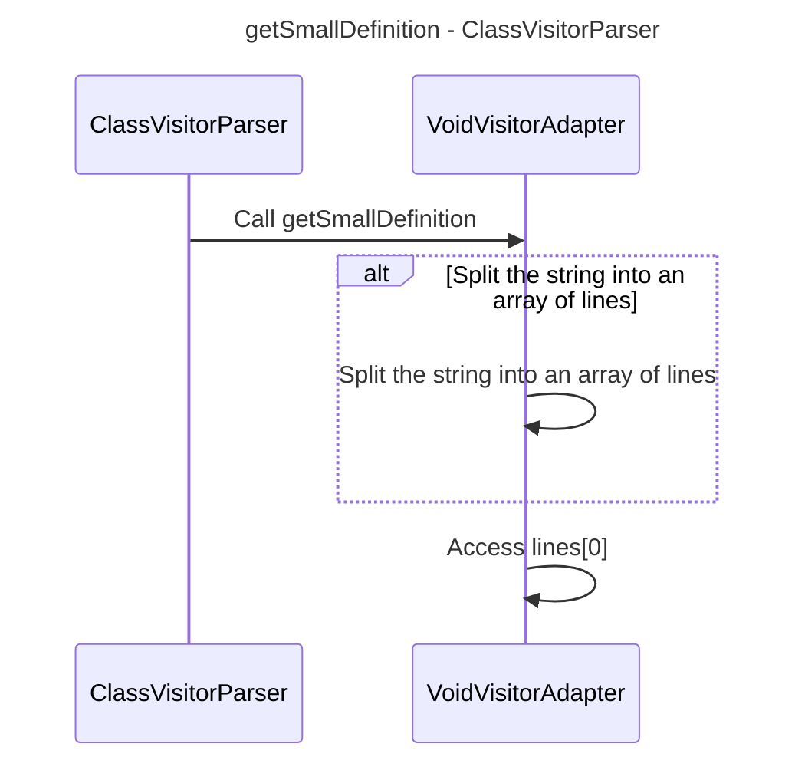

----
# FIX RAW RESPONSE 2
# Participants

1. ClassVisitorParser
2. VoidVisitorAdapter
3. String

# Validation Fixes
There are two validation issues in the broken mermaid diagram: both involve including the primitive/basic data type "String" in the diagram. To fix these issues, we need to remove "String" from the list of participants.

# Interaction After Fix
1. ClassVisitorParser calls getSmallDefinition.
2. getSmallDefinition splits the string into an array of lines.
3. VoidVisitorAdapter splits the string into an array of lines.
4. VoidVisitorAdapter accesses lines[0].

# Final Participants

1. ClassVisitorParser
2. VoidVisitorAdapter

# Plain English Title
"getSmallDefinition - ClassVisitorParser"

# Mermaid Sequence Diagram

