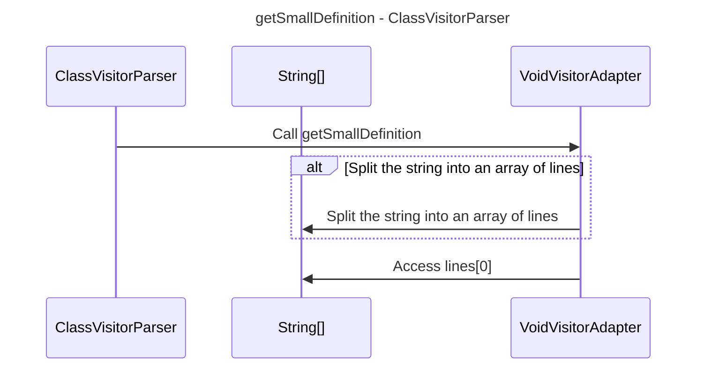

----
# FIX RAW RESPONSE 1
# Participants

- ClassVisitorParser
- VoidVisitorAdapter

# Validation Fixes

## Primitive Rule
The line `VoidVisitorAdapter ->> VoidVisitorAdapter: Access lines[0]` violates the Primitive Rule as it includes the basic data type `byte`. We need to replace the name `byte` with another participant.

# Interaction After Fix

1. `ClassVisitorParser` calls the method `getSmallDefinition` in `VoidVisitorAdapter`.
2. `VoidVisitorAdapter` splits the input string into an array of lines.
3. `VoidVisitorAdapter` accesses the first line of the array.

# Final Participants

- ClassVisitorParser
- String[]
- VoidVisitorAdapter

# Plain English Title

getSmallDefinition - ClassVisitorParser

# Mermaid Sequence Diagram

