# Fix for 3 getSmallDefinition (com.cloudurable.docgen.parser.util.ClassVisitorParser)


# SYSTEM

# I know you are a language model
You do not need to tell me that you are a language model or that your cut-off time was in 2021.

# Output
All output formats will be in markdown.

# Your role
As a senior developer, your assignment is to produce documentation that employs Mermaid sequence diagrams to elucidate
the functionality of specific code sections. Since your target audience may not possess extensive technical
expertise, ensure your diagrams are comprehensible, succinctly capturing all vital points without excess detail.

# Guidelines for Sequence diagrams
Infuse your diagrams with any relevant business rules or domain knowledge derived from comments or log statements
embedded within the code, thus enhancing readability and understanding.

Ensure the diagrams lucidly represent critical concepts. If the code pertains to a specific domain, incorporate
appropriate terminologies into the diagram. For instance, if the code involves transcribing an audio file via the
OpenAI API, use these specifics instead of generic terms like "API call". Replace "System.out.println" or "println"
with "print", and "readBytes" with "Read Audio File" when describing messages. Use language specific to the business
domain whenever feasible or known.

Avoid using participant aliases in the sequence diagrams; stick to the original object or class names in the
class file. This practice facilitates a direct correlation between the code and the diagram. Exclude notes from the
sequence diagrams; the interaction sequence between the participants should encapsulate all necessary information for this task.

Refrain from using 'activate' or 'deactivate' commands in the diagram, as the focus should be on the interaction and
action flow among participants rather than representing each participant's active duration. Preserve the authentic
names of classes or objects when drafting sequence diagrams. Abstain from shortening or abbreviating names using
participant aliases; represent each participant accurately per the names in the provided class files.

When identifying participants, focus on classes or objects that perform substantial actions or exhibit significant interactions.
Exclude data classes or objects used only as information containers from being participants if there are too many.
Focus on actors/participants like `NewsService`, `ArticleSorter`, etc.

Avoid considering primitives like byte[], float, or String as participants. Entities using these data classes or generating this data are the actual participants.
For example, data classes may include File, ChatRequest, EmbeddingRequest, AudioResponse, Article,
"Handled error", "Reported error" can replace Throwable and Exception, which fall into the data category.

Try not to use data classes that are not participants if possible. Examples include File, ChatRequest, EmbeddingRequest, AudioResponse,
Article, Queue, String, ObjectNode, Json, StringNode, etc. Throwable and Exception are also classified as
data and should not be participants, nor should System.out or primitives like byte[], float, int.

Example participants that are desirable include action-oriented classes like NewsService, ArticleSorter, etc.

Using `if`/`else` in Java should be represented by `alt`/`else/end` in mermaid.
Using `switch`/`case` in Java should be represented by `alt`/`else`/`end` in mermaid.
Using `try`/`catch` in Java should be represented by `critical`/`option`/`end` in mermaid.
Using `while` loop in Java should be represented by `loop`/`end` in mermaid.
Using `for` loop in Java should be represented by `loop`/`end` in mermaid.
Using `System.out` in Java should be represented by `Console` in mermaid.
Do not use `Note`.


# Specific Guidelines
* No angle brackets in participant: FAIL=`participant Optional<OfferEntity>`, PASS=`participant Optional~OfferEntity~`
* No angle brackets in message interaction: FAIL=`offerRepository-->>Optional<OfferEntity>: return Optional<OfferEntity>`, PASS=`offerRepository-->>Optional~OfferEntity~: might return an offer`
* No dots in participant FAIL=`participant FacilityConfigProto.FacilityConfig`, PASS=`FacilityConfig`
* Use alt syntax, i.e.,  `alt`/`else`/`end` for Java if/else blocks.
* Use `critical` syntax, e.g.,  `critical`/`option`/`end`.


# Instructions

1. Provide examples of 10 participant class names that we do want under the header desirable participants.
2. Provide 10 participant class names considered as data classes or primitives that we don't want under the header undesirable participants.
3. Develop three illustrative Mermaid sequence diagrams and Java code examples
4. Then come up with three unique Java methods of increasing complexity and generate three corresponding Mermaid sequence
   diagrams from them using the same guidelines.
5. Then show a fundamental error handling example using `critical`/`option`/`end` in Java converted to mermaid.
   * Show the Java and the corresponding mermaid sequence diagram code
6. Then show a basic alt/else/end examples in mermaid.
   * Show the Java and the corresponding mermaid sequence diagram code
7. Then show a complex error handling example using both `alt`/`else`/`end` and `critical`/`option`/`end` in Java converted to mermaid.
8. Then show how to generate a toString using a StringBuilder (Department has a manager and employees as `List<Employee>`)


---

# ASSISTANT
# Desirable Participants

1. NewsService
2. ArticleSorter
3. PaymentProcessor
4. EmailService
5. UserService
6. OrderManager
7. InventoryManager
8. NotificationService
9. AnalyticsService
10. RecommendationEngine

# Undesirable Participants

1. String
2. Integer
3. Float
4. Boolean
5. byte[]
6. Throwable
7. Exception
8. System.out
9. File
10. ObjectNode

# Sequence Diagram 1: User Registration

## Mermaid Sequence Diagram
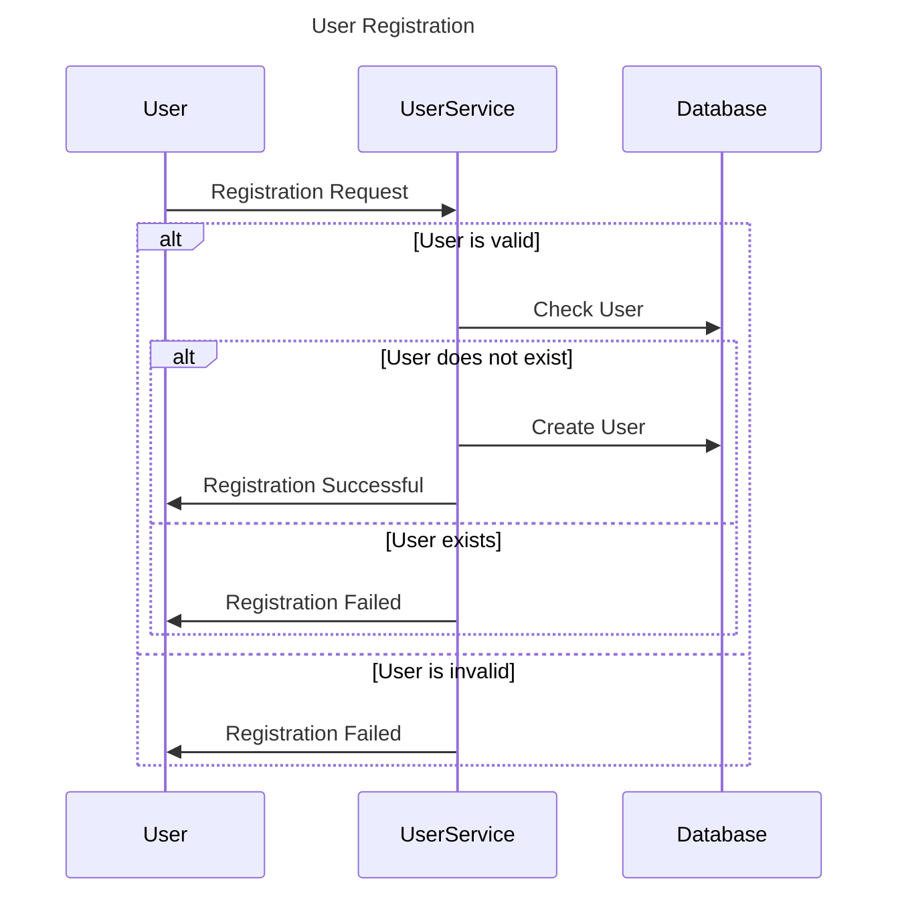

## Java Code Example
```java
public class UserService {
    //...

    public void registerUser(User user) {
        if (isValidUser(user)) {
            if (!database.userExists(user)) {
                database.createUser(user);
                user.registrationSuccessful();
            } else {
                user.registrationFailed();
            }
        } else {
            user.registrationFailed();
        }
    }
    //...
}
```

# Sequence Diagram 2: Order Processing

## Mermaid Sequence Diagram
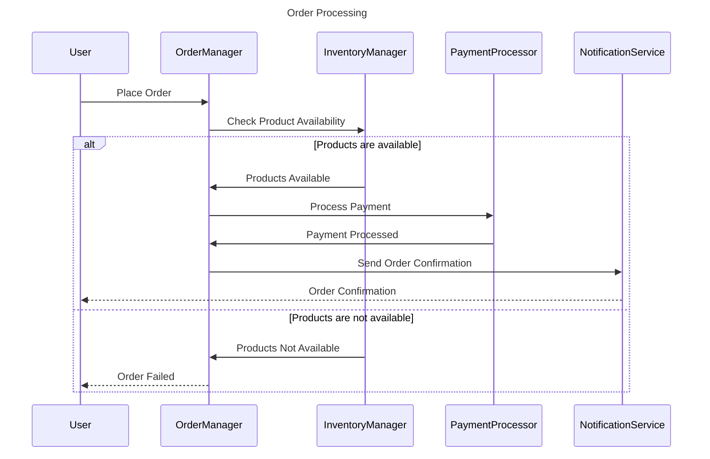

## Java Code Example
```java
public class OrderManager {
    private InventoryManager inventoryManager;
    private PaymentProcessor paymentProcessor;
    private NotificationService notificationService;

    public void processOrder(User user, Order order) {
        if (isValidOrder(order)) {
            if (inventoryManager.checkProductAvailability(order)) {
                paymentProcessor.processPayment(order);
                notificationService.sendOrderConfirmation(user, order);
            } else {
                user.orderFailed();
            }
        } else {
            user.orderFailed();
        }
    }
    //...
}

```

# Sequence Diagram 3: Article Processing

## Mermaid Sequence Diagram
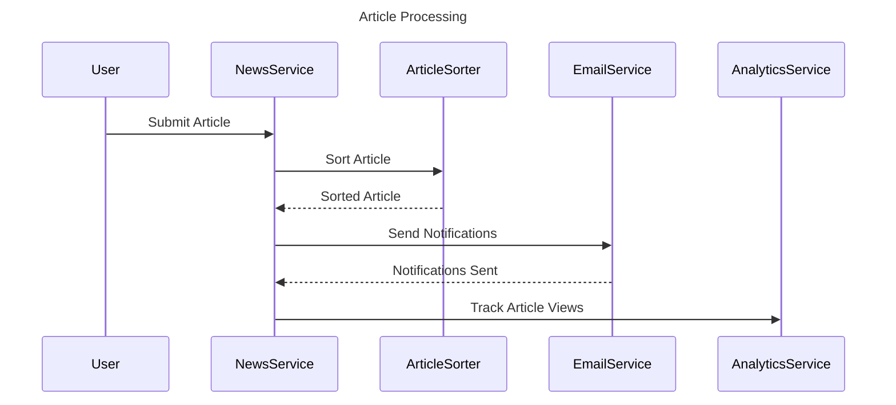

## Java Code Example
```java
public class NewsService {
    private ArticleSorter articleSorter;
    private EmailService emailService;
    private AnalyticsService analyticsService;

    public void processArticle(User user, Article article) {
        articleSorter.sortArticle(article);
        emailService.sendNotifications(article);
        analyticsService.trackArticleViews(article);
    }
}
```

# Java Method 1: Fibonacci Series

## Java Code
```java
public class Fibonacci {
    public void generateFibonacciSeries(int limit) {
        int first = 0;
        int second = 1;
        int next;

        System.out.print("Fibonacci Series: " + first + ", " + second);

        for (int i = 2; i < limit; i++) {
            next = first + second;
            System.out.print(", " + next);
            first = second;
            second = next;
        }
    }
}
```

## Mermaid Sequence Diagram
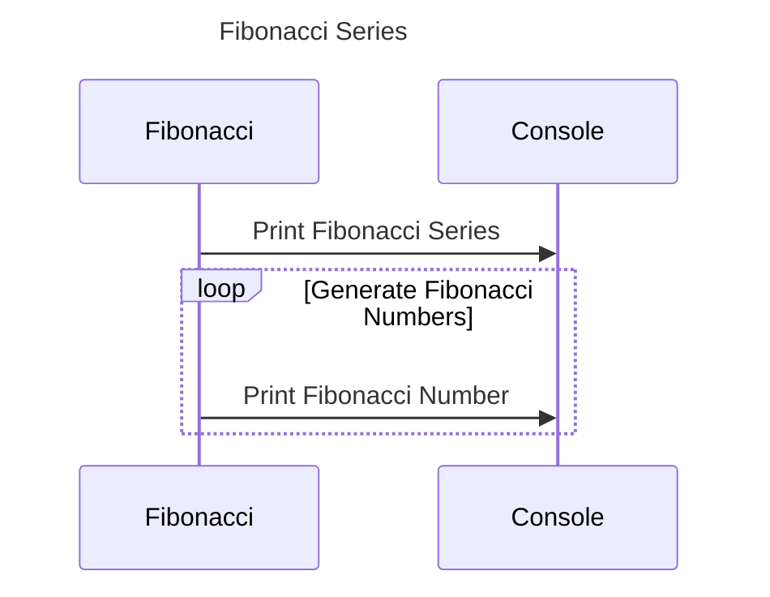

# Java Method 2: File Processing

## Java Code
```java
import java.io.BufferedReader;
import java.io.BufferedWriter;
import java.io.FileReader;
import java.io.FileWriter;
import java.io.IOException;

public class FileProcessor {
    public void processFile(String inputFilePath, String outputFilePath) {
        BufferedReader reader = null;
        BufferedWriter writer = null;

        try {
            reader = new BufferedReader(new FileReader(inputFilePath));
            writer = new BufferedWriter(new FileWriter(outputFilePath));

            String line;
            while ((line = reader.readLine()) != null) {
                // Process the line
                String processedLine = processLine(line);
                writer.write(processedLine);
                writer.newLine();
            }
        } catch (IOException e) {
            // Handle file I/O exception
            e.printStackTrace();
        } finally {
            try {
                if (reader != null) {
                    reader.close();
                }
                if (writer != null) {
                    writer.close();
                }
            } catch (IOException e) {
                // Handle file close exception
                e.printStackTrace();
            }
        }
    }
//...
}
```

## Mermaid Sequence Diagram
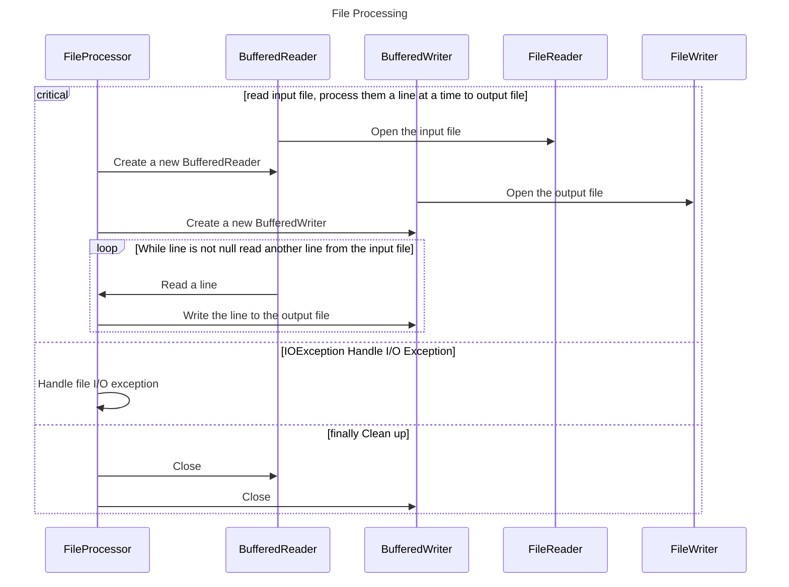

# Java Method 3: Employee Management

## Java Code
```java
import java.util.ArrayList;
import java.util.List;

public class EmployeeManagement {
    private List<Employee> employees;
   //..
    public void performOperation(int operation) {
        switch (operation) {
            case 1:
                // Add employee
                Employee employee = createEmployee();
                addEmployee(employee);
                break;
            case 2:
                // Remove employee
                Employee employeeToRemove = selectEmployee();
                removeEmployee(employeeToRemove);
                break;
            case 3:
                // Get employee by ID
                int id = enterEmployeeId();
                Employee employeeById = getEmployeeById(id);
                displayEmployee(employeeById);
                break;
            default:
                System.out.println("Invalid operation");
                break;
        }
    }
    //..
}
```

## Mermaid Sequence Diagram
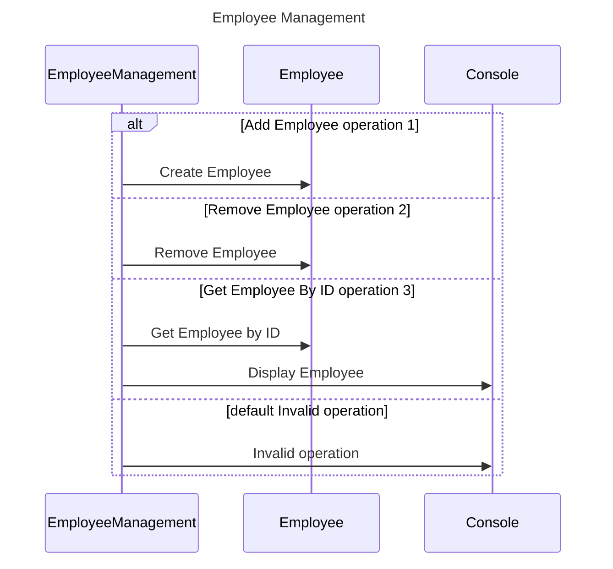

# Error Handling Example

## Java Code
```java
public class Calculator {
    public void divideNumbers(int dividend, int divisor) {
        try {
            int result = dividend / divisor;
            System.out.println("Result: " + result);
        } catch (ArithmeticException e) {
            System.out.println("Error: Division by zero");
        }
    }
}
```

## Mermaid Sequence Diagram
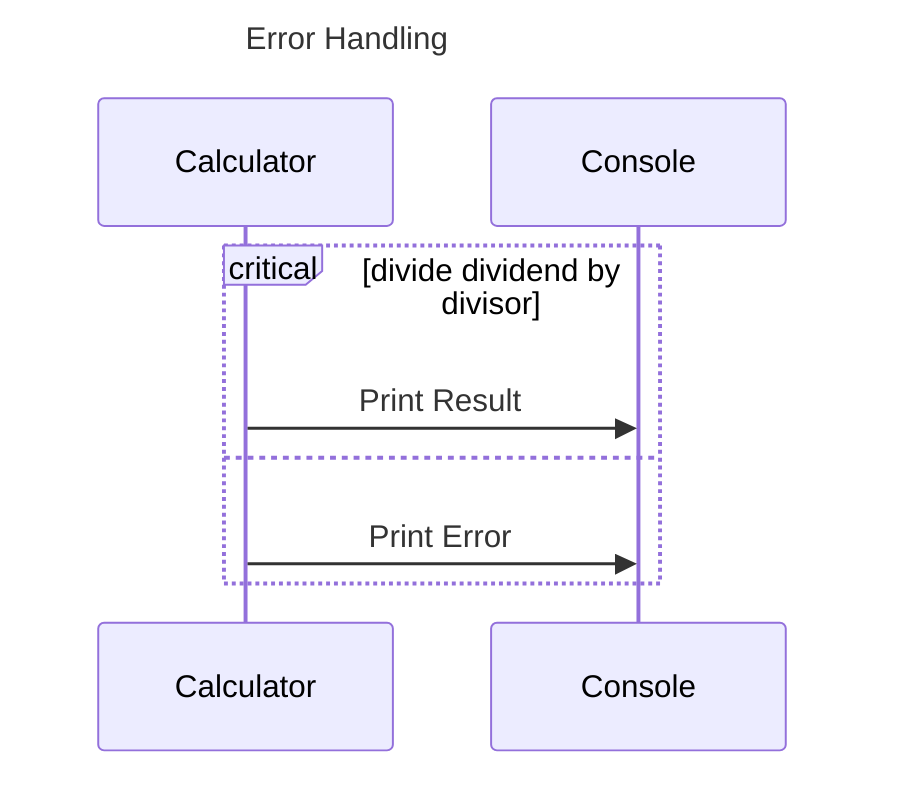

# alt/else/end Example

## Java Code
```java
public class NumberProcessor {
    public void processNumber(int number) {
        if (number > 0) {
            System.out.println("Number is positive");
        } else if (number < 0) {
            System.out.println("Number is negative");
        } else {
            System.out.println("Number is zero");
        }
    }
}
```

## Mermaid Sequence Diagram
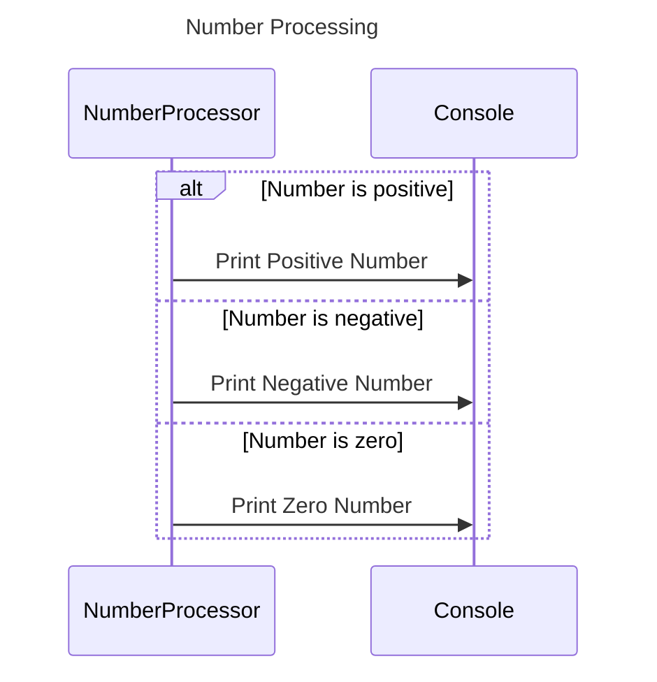

# Complex Error Handling Example

## Java Code
```java
public class ComplexErrorHandling {
    public void processRequest(Request request) {
        try {
            validateRequest(request);
            process(request);
        } catch (InvalidRequestException e) {
            System.out.println("Invalid request: " + e.getMessage());
        } catch (UnauthorizedAccessException e) {
            System.out.println("Unauthorized access: " + e.getMessage());
        } catch (DatabaseException e) {
            System.out.println("Database error: " + e.getMessage());
        } catch (NetworkException e) {
            System.out.println("Network error: " + e.getMessage());
        } finally {
            cleanup();
        }
    }
}

```

## Mermaid Sequence Diagram
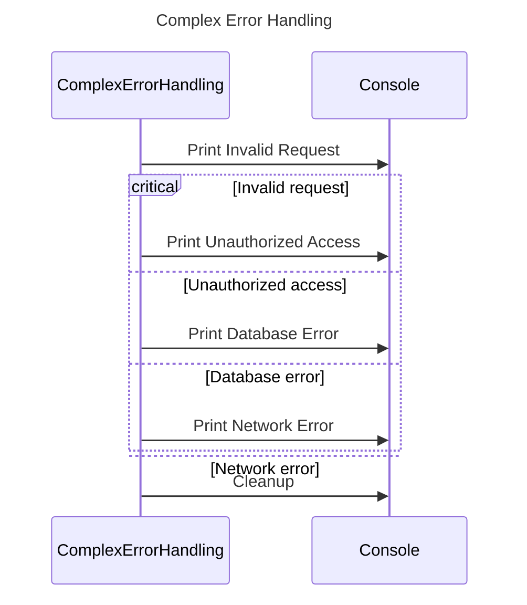

# Generating toString using StringBuilder

## Java Code
```java
import java.util.List;

public class Department {
    private String name;
    private Employee manager;
    private List<Employee> employees;

    // Getters and setters

    @Override
    public String toString() {
        StringBuilder sb = new StringBuilder();
        sb.append("Department: ").append(name).append("\n");
        sb.append("Manager: ").append(manager).append("\n");
        sb.append("Employees: ").append("\n");
        for (Employee employee : employees) {
            sb.append(employee).append("\n");
        }
        return sb.toString();
    }
}
//...
}
```

## Mermaid Sequence Diagram
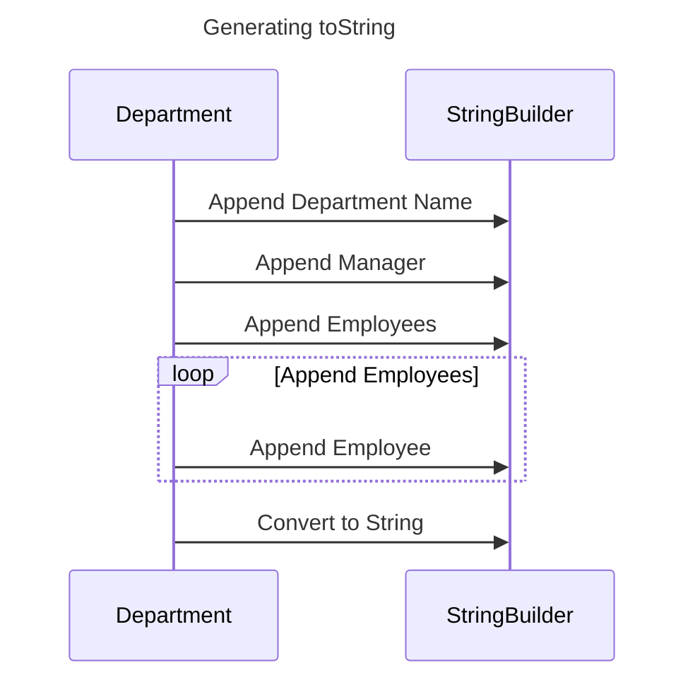

---

# USER
----
# FIX PROMPT TRY 3
# Guidelines for Mermaid Sequence Diagram Generation

* Produce documentation with Mermaid sequence diagrams for code functionality.
* Target audience: non-tech savvy. Ensure diagrams are easily understood and in plain English.
* Include relevant business rules/domain knowledge from code comments or logs in diagrams.
* Diagrams must clearly represent critical concepts. Use business domain-specific language when applicable.
* No method calls in descriptions so `Handler -> HRService : lookupEmployeeById()` not ok, but `Handler -> HRService : Lookup Employee By Id` is ok
* Participants should not be named Exception or Throwable and should not end in the word Exception
* Avoid participant aliases in diagrams. Use original class/object names from code.
* Exclude notes from diagrams. Encapsulate all necessary information within interaction sequence.
* Avoid 'activate'/'deactivate' commands in diagrams. Focus on participant interaction and action flow.
* Do not shorten/abbreviate names in diagrams. Use authentic names of classes/objects.
* Participants should be classes/objects with substantial actions/significant interactions.
* The start of the sequence is a client class if the method is public method
* The start of the sequence is the class of the method if it is a private method
* If sequences are long, then avoid data classes as participants: File, ChatRequest, EmbeddingRequest, AudioResponse, Article, Queue, String, StringNode, ObjectNode, etc.
* Do not use primitives as participants. Entities using/generating data are actual participants.
* Participants should include action-oriented classes like NewsService, ArticleSorter, etc.
* Replace Throwable/Exception with "Handled error", "Reported error".
* Do not use `System.out` as a participant
* Do not use primitives as a participant, e.g., do not use `byte[]`, `float`, `int`.
* Do not use basic data types as a participant, e.g., do not use `String`, `Integer`, `Float`.
* No angle brackets in participant: FAIL=`participant Optional<OfferEntity>`, PASS=`participant Optional~OfferEntity~`
* No angle brackets in message interaction: FAIL=`offerRepository-->>Optional<OfferEntity>: return Optional<OfferEntity>`, PASS=`offerRepository-->>Optional~OfferEntity~: might return an offer`
* No angle brackets in message interaction: FAIL=`offerRepository-->>Optional<OfferEntity>: return Optional<OfferEntity>`, PASS=`offerRepository-->>Optional~OfferEntity~: might return an offer`
* No dots in participant FAIL=`participant FacilityConfigProto.FacilityConfig`, PASS=`FacilityConfig`
* Always add a title.


# Fix Instructions
You just generated a broken mermaid diagram. The mermaid code and validation errors are included below.
Regenerate a mermaid sequence diagram based on the above guidelines titled getSmallDefinition (com.cloudurable.docgen.parser.util.ClassVisitorParser) using the Java code below by
following the instructions below:
1. `Participants`: Create a list of participants
   * Take out of that list any exceptions or throwables, and any primitives or basic data types like String.
   * Take out any `String` in participants or other basic types.
   * Ensure there are no angle brackets in the list of participants.
2. `Validation Fixes`: Go through each validation issue in `Validation JSON`, and plan and show how you are going to fix the problem this time.
4. `Participants After Fix`: Show the list of participants with any fixes applied from the `Fixes` section.
5. Now show the interaction between the participants using a markdown list, and explain each in plain English.
   * Ensure there are no angle brackets in the interactions. Replace <> with ~, i.e., List<Employee> to List~Employee~.
   * Ensure there are no method calls in the interaction description, just plain English.
   * Ensure that all `alt`/`else` have a corresponding `end`. 
   * Ensure that all `critical`/`option` have a corresponding `end`.
6. `Interaction After Fix`: Show the list of interaction with any fixes applied from the `Validation Fixes` section.
7. `Final Participants`: Show the list of participants from `Participants After Fix` with participants removed if participant is not used in `Interaction After Fix` .
8. `Plain English Title`: Create a plain English title based on  "getSmallDefinition (com.cloudurable.docgen.parser.util.ClassVisitorParser)".
   * No method calls so nothing like `toString()`
   * No parenthesis: NO '(' NO ')'. 
9. Finally, create the mermaid code for the sequence diagram
   * make sure it uses the `Plain English Title` for the title. 
   * make sure it uses participants from the plain `Final Participants`.
   * Do not add `Notes`.
   * Make sure it uses interactions from `Interaction After Fix`.
      * Ensure that all `alt`/`else` have a corresponding `end`. 
      * Ensure that all `critical`/`option` have a corresponding `end`.


# Broken Mermaid
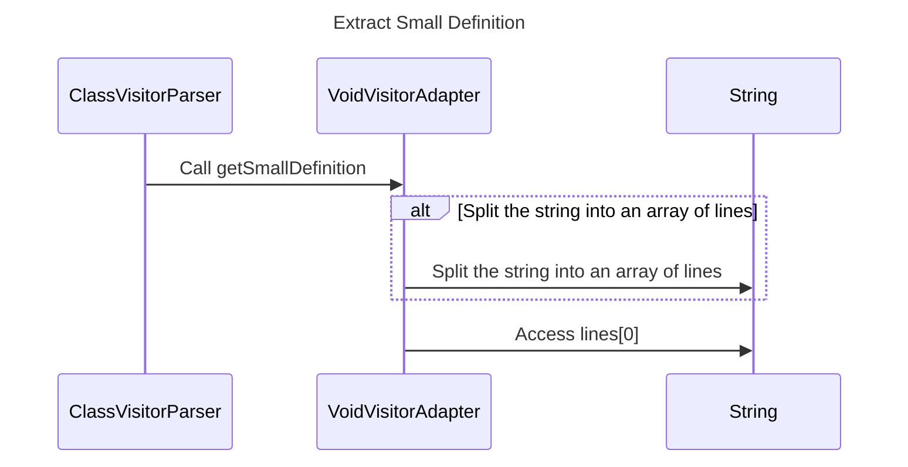

# Java method 

```java

Parent class:
public class ClassVisitorParser extends VoidVisitorAdapter<Void> 
Parent Class Fields:
	private static final Pattern JAVA_DOC_REGEX = Pattern.compile("^/\\*\\*.*?\\*/\\s*", Pattern.DOTALL);
	private final List<JavaItem> javaItems;
	private CompilationUnit compilationUnit;
Method Body:
private static String getSmallDefinition(String text) {
    // Split the string into an array of lines
    String[] lines = text.split("\\{");
    return lines[0];
}

```


# Validation JSON

```javascript 

[
    {
        "lineNumber": 7
,
        "violatedLine": "    participant String"
,
        "ruleName": "Primitive Rule"
,
        "description": "Do not include primitive or basic data types as participants in the sequence diagram. Disallow Specific Words: The line cannot contain any of the specific words: \"byte\", \"float\", \"int\", \"double\", \"long\", \"boolean\", \"char\", \"List\", \"File\", and \"bytes\".\n\nDisallow Square Brackets: The line cannot contain a square bracket character, either opening \"[\" or closing \"]\". Do not include \":\". Do not include angle brackets \"<\" \">\". Use ~ instead of angle brackets \n"

    },
    {
        "lineNumber": 11
,
        "violatedLine": "        VoidVisitorAdapter ->> String: Split the string into an array of lines"
,
        "ruleName": "Primitive Rule"
,
        "description": "Do not include primitive or basic data types as participants in the sequence diagram. Disallow Specific Words: The line cannot contain any of the specific words: \"byte\", \"float\", \"int\", \"double\", \"long\", \"boolean\", \"char\", \"List\", \"File\", and \"bytes\".\n\nDisallow Square Brackets: The line cannot contain a square bracket character, either opening \"[\" or closing \"]\". Do not include \":\". Do not include angle brackets \"<\" \">\". Use ~ instead of angle brackets \n"

    },
    {
        "lineNumber": 13
,
        "violatedLine": "    VoidVisitorAdapter ->> String: Access lines[0]"
,
        "ruleName": "Primitive Rule"
,
        "description": "Do not include primitive or basic data types as participants in the sequence diagram. Disallow Specific Words: The line cannot contain any of the specific words: \"byte\", \"float\", \"int\", \"double\", \"long\", \"boolean\", \"char\", \"List\", \"File\", and \"bytes\".\n\nDisallow Square Brackets: The line cannot contain a square bracket character, either opening \"[\" or closing \"]\". Do not include \":\". Do not include angle brackets \"<\" \">\". Use ~ instead of angle brackets \n"

    }
]

```


# Participants
(format markdown)

# Validation Fixes
(format markdown)

# Interaction After Fix
(format markdown)

# Final Participants
(format markdown)

# Plain English Title
(format markdown)

# Mermaid Sequence Diagram

```mermaid
---
title: {{Plain English Title}}
---

sequenceDiagram
    {{Final Participants}}
    {{Clean Interactions}}
```

---
